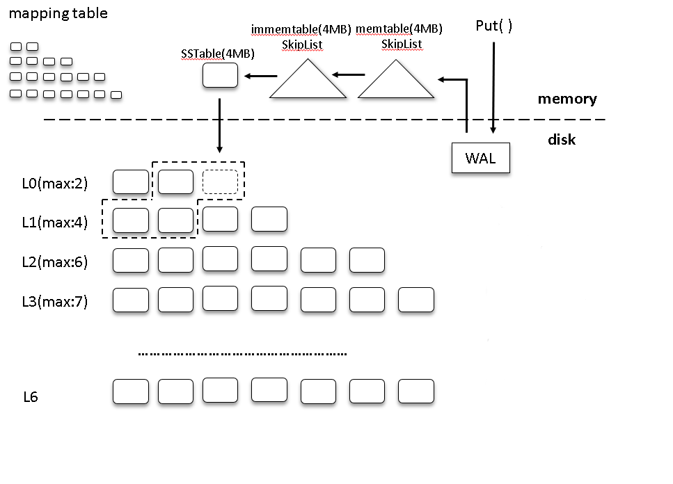
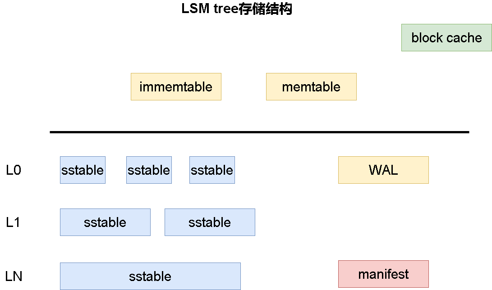
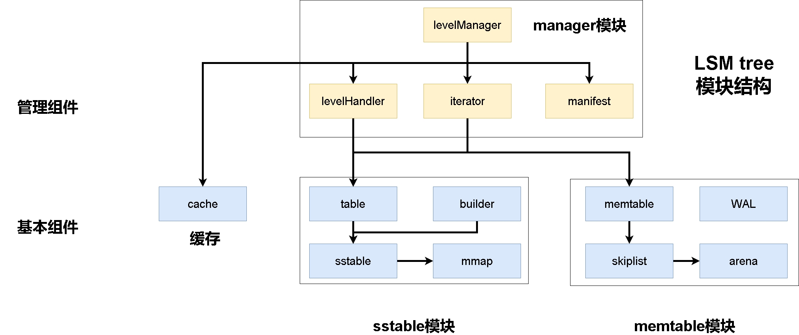

# LSM-tree原理

# 概述

引用wiki上的解释：

LSM tree也叫日志结构合并树（log-structured merge-tree）。是一种具有性能特征的数据结构，使其在**提供高插入量的文件的索引访问**方面很有吸引力。与其他搜索树一样LSM tree**维护键值对**。LSM tree在**两个或多个单独的结构中**维护数据，每个结构都针对其各自的底层存储介质进行了优化;数据在两个结构之间高效、批量同步。

>批注：这里提到LSM tree重要应用场景：大量数据插入请求。同时了解了LSM tree虽说是一种数据结构，但并不是我们平时所说的树、图等单一的小型数据结构。而是由多种结构组织成的“架构”

LSM 树的一个简单版本是两级 LSM 树。两级LSM树包括两个树状结构，称为C0和C1。C0 较小且驻留在内存，C1驻留在磁盘上。新记录将插入到C0 组件中。如果C 0组件超过特定大小，则从C0中删除连续的条目段，并将其合并到C1中。

实践中使用的大多数LSM树都采用多个级别。级别 0 保存在主内存中，可以使用树表示。磁盘上的数据被组织成排序的数据运行。每个run都包含按索引键排序的数据。run可以在磁盘上表示为单个文件，也可以表示为具有不重叠键范围的文件集合。若要对特定键执行查询以获取其关联值，必须在级别 0 树中搜索以及每个run。 LSM树的阶梯合并版本是LSM树的变体，它支持多个级别，每个级别有多个树结构。

>批注：这里进一步阐述了LSM tree的基本组成。那就是在内存中和磁盘中分别维护了不同的数据结构，这种数据结构是由内存和磁盘特点的不同设计的。对于数据的插入，我们总是插入内存中，当内存空间达到上限我们才会将数据写入磁盘。同时磁盘数据是按一定顺序排列的，这是为了更好的支持查询。我们将每一组有序的数据文件成为一个run。不同的run之间表示的数据范围则可能无序，因此我们在检索给定索引键时需要搜索level0（内存中数据结构）以及每个run（磁盘中数据文件集合）

到这里我们已经基本了解了LSM tree的一些基本特点：
- KV数据结构，即LSM tree是一种维护键值对的数据结构
- 用于应对数据写入密集的场景，即LSM tree写数据速度非常快
- 是一种持久化数据结构，LSM tree数据会被保存在磁盘中

另外我们还提到了LSM tree的基本结构：
- 大体上分为两层：内存和磁盘。分别用不同的数据结构组织数据。同时内存中数据会被同步进磁盘
- 磁盘中可能被组织为一定层次结构，同时维护数据相对有序以保证查询效率

# LSM tree架构

至此我们已经了解了LSM tree的一些基本概念。但是LSM tree具体是什么还很模糊。

下面是LSM tree架构的一种实际实现。注意LSM tree只是一个概念，它并没有规定我们具体应该如何实现一个LSM tree。我们下面给出的是一个已有LSM tree实现中常用结构。

正如上文所说LSM tree分为两部分。一部分位于内存，一部分位于磁盘。注意我们上文将内存数据结构称为第0层，但是上图中将磁盘中最上层称为第0层。具体应该怎么称呼其实并不重要。但我们接下来提到层次结构都特指磁盘中的文件，而不将内存纳入层次结构中。

内存中保存数据的组件称为memtable。我们可以使用不同类型的数据结构实现memtable，但是被使用最广泛的数据结构为skiplist。我们每次插入数据都会直接插入memtable中。但由于memtable驻留在内存，因此无法无限插入，在到达一定阈值我们会将内存中的memtable转换为sstable并刷写到磁盘中。而所谓的immemtable是memtable到sstable的过渡状态，因为我们将memtable转为sstable并刷写到磁盘过程需要时间，在此期间我们还需要处理新数据的插入工作。因此将memtable转换为sstable之前会新创建一个空的memtable用于接收新数据，而旧的memtable称为immemtable，或者说是一个只读的memtable。

磁盘中用于保存数据的组件称为sstable。sstable将数据按序排列存储成文件的形式。实际上memtable中数据本身就是有序的，因此对于那些直接从memtable转成的sstable当然还是有序的，通常这些sstable放在L0层。而对于L0层之下的那些sstable是由其他上层的sstable通过归并排序合并合成，因此仍然是有序的。当然我们可能需要仔细设计sstable中数据的组织形式能够更好的节省磁盘空间，同时能够提升查询效率。

第0层的sstable就是内存中memtable直接持久化到磁盘的结果。而下面若干层通常是由上层sstable文件归并排序合并成的更大的sstable。这样的组织形式及将文件合并的操作是效率权衡后的结果。至于为什么需要组织成这样的层次结构，我们会在LSM-tree的[compact](manager-compact.md)操作中详细解释。

另外细心的话可以看到上图中还有两个额外的组件：

一个是WAL（Write Ahead Log），指预写日志，如果了解数据库的话应该不陌生。由于数据总是直接插入内存的memtable中，那么我们应该有一种机制确保数据库宕机或发生异常，内存数据不会丢失，这就是WAL作用。我们在插入数据时总是会先追加数据到WAL文件中，然后再写入memtable。因此WAL文件也是数据库写入效率的瓶颈之一。

另一个是内存中的mapping table。这实际上并不是一种特殊的数据结构，mapping table也不是一个专用术语。他表示的是磁盘sstable的一些基本信息，如每一层有哪些sstable，每个sstable中索引键的范围等，我们将这些信息保存在内存中方便对sstable进行检索。

# 插入与查询

了解了LSM tree基本结构，我们来看看LSM tree中具体的增删改流程应该是什么样的，同时解释为什么LSM tree被用在写入密集场景中。

我们在了解增删改查操作时需要明白LSM tree为了保证效率，增删改查永远也不会直接对磁盘数据进行增删改查。磁盘上的数据只有通过compact操作进行整理。

**插入操作**

插入操作我们只需要单纯的向memtable插入键值对即可。如果memtable已经存在对应索引键，那么我们变为更新操作。

因此可以看到LSM tree插入操作是非常快的，只需要在memtable中插入一条数据即可。这个复杂度无论是skiplist还是红黑树结构都能达到O(logN)。

**删除操作**

删除操作无论我们的数据在不在内存中都只是插入一个“墓碑标记”即可。你可能会问，为什么数据在内存中不直接删除呢？那是因为如果磁盘中也有对应索引键的数据，我们删除内存中数据后，在后续查找操作会找到磁盘中对应数据，没有达到删除效果。但如果我们直接使用“墓碑标记”那么在查找过程中，遍历memtable我们就知道这条数据被删除了，不会再去磁盘查找。

**更新操作**

更新数据在memtable中我们直接更新即可。但如果不在内存，我们就直接插入。我们已经提到了，这些数据在磁盘的compact操作中将被处理。即便我们有同一索引键的多个版本数据，compact时将会舍弃过期数据，只保留新数据。

**查询操作**

在此之前我们应该了解LSM tree中数据是怎么排列的。对于memtable数据显然是有序的。而磁盘中sstable内部数据也是有序的。L0层的sstable之间显然索引键可能会相互重叠，因为它们就是直接由memtable转换而来的。但是对于其他层的sstable呢？这取决于我们使用的compact方式，使用level compaction那么每一层的sstable在层内是全局有序的。

假设我们使用level compaction。那么查询操作需要查询的内容包括内存中的memtable，L0层所有可能的sstable（注意L0层sstabel索引键可能重合，因此我们需要遍历所有可能的sstable），非L0层至多需要遍历一个sstable（非L0层sstable全局有序，如果存在对应索引键只可能存在其中一个sstable中）。

我们遍历顺序是memtable，L0层sstable、L1层sstable以此类推。因此查询总是获取的最新键值。

# 放大问题

这节我们讨论LSM tree中被研究最广泛的问题，那就是放大问题。放大问题分为三个：
- 写放大
- 读放大
- 空间放大

写放大就是单纯对于一条键值对数据项而言，我们在整个系统中为了保存这一条数据可能需要写入超过这条数据本身的信息量的内容。如一条数据可能被写多次。

读放大就是读取一条数据可能需要读取超过数据本身信息量的内容。

空间大放大则是存储一条数据可能需要存储超过数据量本身的内容。

实际上任何一个数据库系统中都或多或少存在放大问题。因为我们不可能在不读取、存储、写入额外数据的情况下只对数据本身进行管理。

那么对于LSM tree中的放大问题具体来自哪些方面呢？

**写放大**

写放大主要来自于磁盘中不同层之间sstable的合并操作。上文中已经提到了，为了保证数据的查询效率以及其他考量。我们会不断将上层sstable合并到下层。这意味着同一条数据我们可能进行多次写入操作。

**读放大**

LSM tree为了保证写效率总是以追加的方式插入数据，我们上面也提到对于LSM tree的查询操作需要检索memtable以及若干个sstable。这显然是一种读放大。

另外一种读放大是因为我们的键值对存在sstable的block中，可以从这里看到我们实现的一种[sstable](sst-sstable.md)结构。我们每次读取数据总是需要将包含数据的block加载到内存中，这也是一种读放大。

**空间放大**

空间放大就更好理解了。任何数据库系统都会有空间放大，因为我们要组织数据，并提供一些元信息。

而针对LSM tree的空间放大体现在我们在更新或删除时可能并不会原地更新数据或直接删除数据，而是插入标记。这也造成了空间放大。

空间放大问题我们在compact操作中会解决，因此通常不作为重点研究问题。

**读写放大的权衡**

从上面对读写放大问题的解释中我们应该会发现这两者之间存在一定关系。LSM tree为了保证写入效率采取了追加写入的方式，我们仅仅在memtable内部维护数据的有序性，但是memtable转为sstable之后，我们只是简单的将其追加写入磁盘。这无疑保证了sstable写入效率。但是我们要读取数据呢？对于这些直接刷入磁盘的sstable（即L0层sstable）我们不得不遍历所有可能存在数据的sstable，最坏情况下我们可能要读取整个L0层的sstable。因此保证写入效率的同时，我们引入了读放大问题。

那么如何解决读放大呢？我们需要定期将这些索引键互相重叠的sstable归并排序。但这一操作又需要我们对同一条数据写入多次。因此我们在保证读取效率同时，又引入了写放大问题。

综上所述，我们可以说读写放大问题在很多情况下是相互矛盾的。我们很难同时提高读写效率，更多的时候需要根据实际需求进行取舍。

# 一个更加完整的LSM tree架构

至此我们已经介绍了LSM tree的基本概念，架构，如何使用LSM tree执行增删改查以及所有数据库系统都需要考虑的放大问题及对应原因的分析。

但一个实际的LSM tree的构成远不止这些。比如我们可能会需要cache来提高查询性能、需要manifest文件保证系统的一致性。

我们接下来将会实现一个完整的LSM tree。下面则是我们整个LSM tree在内存和磁盘中的存储结构：

下面是我们的LSM tree模块设计：

