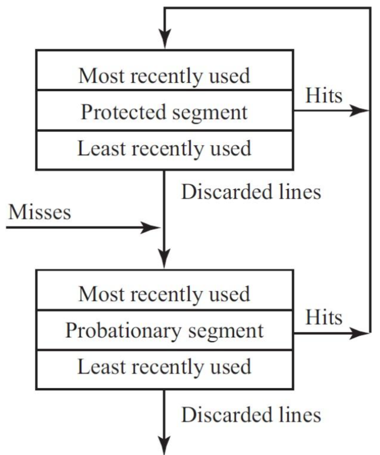
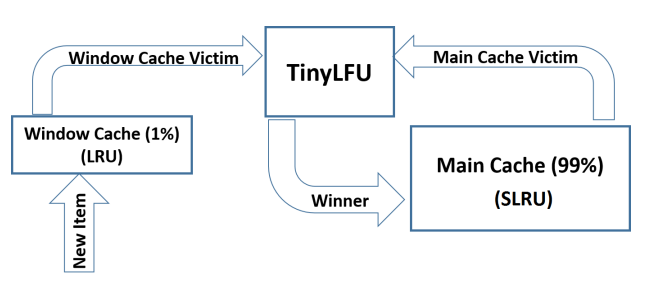

# W-TinyLFU


# LRU和LFU优缺点

LRU根据数据访问的先后顺序来淘汰缓存数据。因此LRU动态性更好，更能适应访问模式的改变。但是也可能将历史热点数据移除缓存。

LFU根据数据访问的频率顺序来淘汰缓存数据。因此LFU对热点数据访问更加友好，但是如果热点数据不再访问，由于其频数够高，很可能长时间无法清出缓存，动态性更差。


# TinyLFU

我们希望给LFU赋予LRU的优点。一方面希望减少LFU为每条缓存数据记录频次所需的内存占用。另一方面希望LFU有一种机制能够淘汰掉历史热点数据。

LFU有两个缺点：一方面LFU为每条缓存数据保存counter需要额外的内存占用。另一方面LFU中高频词数据可能一直驻留在缓存中，很难被淘汰。

先看第一点：如何减少内存占用。LFU中每条缓存数据都需要一个字段来存储counter。这个字段如果单独存储那么至少需要一个字节。但如果我们将所有缓存数据的counter存储在一起，可以用更少的空间存储counter（比如半子节）。这种做法引出另一个问题，将counter和缓存数据分开存储，如何建立一一对应关系？答案是使用哈希函数。就像bloomfilter一样，我们对缓存数据的key做hash运算（可能不止一次hash运算），并将得到的这些hash运算结果作为counter的索引值，然后更新这些counter即可。

这样做也会产生哈希冲突，就像bllomfilter一样。哈希冲突产生的后果有两个：为某个key累加counter时可能因为与其他key冲突而对相同的一组counter累加。我们不会做任何处理，实际上我们并不关心某个key的精确访问次数，能表示大概的访问频率即可。另一方面当获取某个key计数时，一组counter的值可能并不相同，到底以哪个counter为准呢？答案是最小的那个。因为counter值越小意味着冲突越少。

然后看第二点：如何淘汰历史热点数据。我们只需要经过一段时间将所有counter都减少即可。

使用上面两个策略进行LFU计数的算法就是Count-Min Sketch算法。Count-Min Sketch是一种高效的计数方法，通过牺牲准确性提高效率。牺牲准确性的含义我们已经解释了，我们可能对不同key累加相同的counter，以及获取某个key计数值是对应一组counter中最小的那个。

使用了Count-Min Sketch算法的LFU也被称为TinyLFU。

## cmRow

上文提到了一个Count-Min Sketch就像bloomFilter一样对给定key会映射到多个字节序列，我们称之为counter。这里我们实现对于一个counter字节序列的操作。

```go
type cmRow []byte //Count-Min Row，一个key到一个counter

func newCmRow(numCounters int64) cmRow {
	return make(cmRow, numCounters/2) //每个counter用4位表示，1字节可表示2个counter
}

// 获取第n个counter值
func (r cmRow) get(n uint64) byte {
	return r[n/2] >> ((n & 1) * 4) & 0x0f
}

// 第n个counter值递增
func (r cmRow) increment(n uint64) {
	i := n / 2 //counter在第几个byte
	s := (n & 1) * 4
	v := (r[i] >> s) & 0x0f //取当前counter值
	if v < 15 {
		r[i] += 1 << s
	}
}

// 所有counter计数值减半
func (r cmRow) reset() {
	for i := range r { //所有counter计数值减半
		r[i] = (r[i] >> 1) & 0x77
	}
}

// 清空所有counter
func (r cmRow) clear() {
	for i := range r {
		r[i] = 0
	}
}
```

## cmSketch


有了对一个counter的计数操作，很容易定义包含多个counter的Count-Min Sketch。下面是cmSketch定义。

注意cmSketch中mask的实际上用于将hash运算后的值限定在counter范围内，即转换为对counter的索引值。

```go
const (
	cmDepth = 4 //一个key对应cmDepth个counter
)

type cmSketch struct {
	rows [cmDepth]cmRow
	seed [cmDepth]uint64 //每个seed对应一个hash函数
	mask uint64
}

// 创建Count-Min Sketch，传入counter数量
func newCmSketch(numCounters int64) *cmSketch {
	if numCounters == 0 {
		panic("cmSketch: invalid numCounters")
	}

	// numCounters是二次幂，1000...000
	numCounters = next2Power(numCounters)
	// mask是0111...111
	sketch := &cmSketch{mask: uint64(numCounters - 1)}
	source := rand.New(rand.NewSource(time.Now().UnixNano()))

	// 初始化4行
	// 0000,0000|0000,0000|0000,0000
	// 0000,0000|0000,0000|0000,0000
	// 0000,0000|0000,0000|0000,0000
	// 0000,0000|0000,0000|0000,0000

	for i := 0; i < cmDepth; i++ {
		sketch.seed[i] = source.Uint64()
		sketch.rows[i] = newCmRow(numCounters)
	}

	return sketch
}

// 对某个key所有counter累加
func (s *cmSketch) Increment(hashed uint64) {
	// 对于每一行进行相同操作
	for i := range s.rows {
		s.rows[i].increment((hashed ^ s.seed[i]) & s.mask) //计算hash并累加counter
	}
}

// 取某个key对应最小counter值
func (s *cmSketch) Estimate(hashed uint64) int64 {
	min := byte(255)
	for i := range s.rows {
		val := s.rows[i].get((hashed ^ s.seed[i]) & s.mask)
		if val < min {
			min = val
		}
	}

	return int64(min)
}

// 所有counter减半
func (s *cmSketch) Reset() {
	for _, r := range s.rows {
		r.reset()
	}
}

// 所有counter清零
func (s *cmSketch) Clear() {
	for _, r := range s.rows {
		r.clear()
	}
}

// 快速计算大于 X，且最接近 X 的二次幂
func next2Power(x int64) int64 {
	x--
	x |= x >> 1
	x |= x >> 2
	x |= x >> 4
	x |= x >> 8
	x |= x >> 16
	x |= x >> 32
	x++
	return x
}
```


next2Power函数用于计算大于x的最小二次幂。我们以int8为例说明算法的含义。例如要求数字9（00001001）的二次幂。我们只需要把这个数字最高位1以及之后的所有位都置为1，即00001111，然后再对这个结果加1即可。因此我们看到函数中x |= x >> 1、x |= x >> 2实际上就是在不断地复制最高位的1到低位。

而最开始的x--是为了针对x本身是二次幂的情况，我们希望结果是x本身，而不是比x大的最小二次幂。


# Window LRU

WindowLRU就是普通LRU实现，作为W-TinyLFU中的Window Cache部分被实现。

下面是WindowLRU的实现：

```go
type windowLRU struct {
	data map[uint64]*list.Element  //key到链表节点的映射
	cap  int  //容量
	list *list.List  //数据链表
}

type storeItem struct {
	stage    int
	key      uint64
	conflict uint64
	value    interface{}
}

func newWindowLRU(size int, data map[uint64]*list.Element) *windowLRU {
	return &windowLRU{
		data: data,
		cap:  size,
		list: list.New(),
	}
}
```

我们缓存的数据类型为storeItem，其中stage是用于标注数据在哪个Cache，在Window Cache为0，在Main Cache为1或2，Main Cache在下面解释。另外storeItem中包含两个hash数据成员key和conflict。其中key是数据键值的hash映射，被用于索引数据。而conflict哈希值是为了防止keyhash发生冲突，用于进行二次确认。value则是空接口类型，这在go语言中表示能够接收任何类型作为value。之所以实现为接口类型是因为在我们的KV引擎中，cache不仅仅用于缓存entry数据条目，同时也会缓存sst文件中的block数据信息等。

我们为WindowLRU提供两个主要操作，add方法用于添加数据，get用于获取数据。

实际实现中get做的只是将要获取数据移动到链表的头部。因为WindowLRU只是W-TinyLFU的一部分，W-TinyLFU的get操作会实际返回数据。

add方法需要注意的是实现中将旧的被淘汰数据作为返回值返回。之所以返回是因为我们要对淘汰数据进一步判断，如果这是一条热点数据，我们应该将其加入Main Cache，下面会介绍Main Cache。

```go
// 向windowLRU加入新数据条目newitem，并返回淘汰条目
func (lru *windowLRU) add(newitem storeItem) (eitem storeItem, evicted bool) {
	// 如果 window 部分容量未满，直接插入
	if lru.list.Len() < lru.cap {
		lru.data[newitem.key] = lru.list.PushFront(&newitem)
		return storeItem{}, false
	}
	//如果 widow 部分容量已满，按照 lru 规则从尾部淘汰
	evictItem := lru.list.Back()
	item := evictItem.Value.(*storeItem) //获取evictItem的Value，转型为*storeItem

	delete(lru.data, item.key) //淘汰键值从map移除

	// 这里直接对 evictItem 和 *item 赋值，避免向runtime 再次申请空间
	eitem, *item = *item, newitem

	lru.data[item.key] = evictItem //新增键值加入map
	lru.list.MoveToFront(evictItem)
	return eitem, true
}

func (lru *windowLRU) get(v *list.Element) {
	lru.list.MoveToFront(v)
}
```

注意我们的add方法中并没有判断插入数据的key是否已经存在。正确的实现中理应考虑key相等的情况。但是实际我们在使用window lru时会先get数据，如果有这个数据就直接返回。否则才会插入数据。因此add中插入数据总是不同的数据。


# segment LRU

SLRU（segment LRU）是一个LRU的变种，作为W-TinyLFU的Main Cache部分被实现。SLRU将空间分为两个段，实际上是两个LRU。分别为probationary和protected。所谓probationary就是处于试用期的数据，还不确定是不是热点数据，所有新数据条目被访问，优先被缓存在probationary段。而protected就是被保护的数据，也就是真正的热点数据，当probationary中数据再次命中，则移出probationary段并加入protected段。下面是SLRU的缓存策略：



总结起来如下。
- probationary策略：
  - 进入策略，新数据被访问或者protected达到容量淘汰数据到probationary。数据放在probationary队头
  - 淘汰策略，probationary达到容量。probationary队尾数据从缓存移除
- protected策略：
  - 进入策略，probationary中数据被再次访问。数据放在protected队头
  - 淘汰策略，protected达到容量。protected队尾数据放在probationary队头（和probationary进入策略一致）

下面是segmentedLRU实现，其中stageOne表示probationary，stageTwo表示protected：

```go
type segmentedLRU struct {
	data                     map[uint64]*list.Element
	stageOneCap, stageTwoCap int
	stageOne, stageTwo       *list.List
}

const (
	STAGE_ONE = iota + 1
	STAGE_TWO
)

func newSLRU(data map[uint64]*list.Element, stageOneCap, stageTwoCap int) *segmentedLRU {
	return &segmentedLRU{
		data:        data,
		stageOneCap: stageOneCap,
		stageTwoCap: stageTwoCap,
		stageOne:    list.New(),
		stageTwo:    list.New(),
	}
}
```

与WindowLRU一样，我们为segmentedLRU实现add和get方法：

```go
// 向segmentedLRU加入新数据条目newitem
func (slru *segmentedLRU) add(newitem storeItem) {
	// 先进来的都放 stageOne
	newitem.stage = 1

	// 如果 stageOne 没满，整个LFU 区域也没满
	// 注意这里如果一直有新数据加入，stageOne会挤占StageTwo空间
	if slru.stageOne.Len() < slru.stageOneCap || slru.Len() < slru.stageOneCap+slru.stageTwoCap {
		slru.data[newitem.key] = slru.stageOne.PushFront(&newitem)
		return
	}

	//走到这里说明 StageOne 满了，或者整个 LFU都满了
	//那么需要从 StageOne 淘汰数据了
	e := slru.stageOne.Back()
	item := e.Value.(*storeItem)

	//这里淘汰就是真的淘汰了
	delete(slru.data, item.key)

	*item = newitem

	slru.data[item.key] = e
	slru.stageOne.MoveToFront(e)
}
```

注意到这里add操作总是加入stageOne，意味着add数据并灭有考虑key相等的情况。其实正确的实现中理应考虑key相等的情况。但是实际我们在使用slru时会先get数据，如果有这个数据就直接返回。否则才会插入数据。因此add中插入数据总是不同的数据。

```go
// segmentedLRU访问数据节点v
func (slru *segmentedLRU) get(v *list.Element) {
	item := v.Value.(*storeItem)

	// 若访问的缓存数据，已经在 StageTwo，只需要按照 LRU 规则提前即可
	if item.stage == STAGE_TWO {
		slru.stageTwo.MoveToFront(v)
		return
	}

	// 若访问的数据还在 StageOne，那么再次被访问到，就需要提升到 StageTwo 阶段了
	if slru.stageTwo.Len() < slru.stageTwoCap {
		slru.stageOne.Remove(v)
		item.stage = STAGE_TWO
		slru.data[item.key] = slru.stageTwo.PushFront(item)
		return
	}

	// StageTwo达到最大容量，需要淘汰旧数据
	// StageTwo 中淘汰的数据进入 StageOne
	// 这里直接将item和StageTwo要淘汰的数据进行交换
	back := slru.stageTwo.Back()
	bitem := back.Value.(*storeItem)

	*bitem, *item = *item, *bitem

	bitem.stage = STAGE_TWO
	item.stage = STAGE_ONE

	// 现在bitem是新访问数据，item是StageTwo被淘汰数据

	slru.data[item.key] = v
	slru.data[bitem.key] = back

	slru.stageOne.MoveToFront(v)
	slru.stageTwo.MoveToFront(back)
}
```


细心的话能够发现slru的add操作和WindowLRU不同。WindowLRU的add操作会返回淘汰数据，而slru的不会。WindowLRU返回的原因是淘汰数据需要加入slru的stageOne。slru不返回的原因是slru数据淘汰了就真的从缓存中移除了。

下面我们会看到slru满后，Window Cache中淘汰数据并不一定要加入Main Cache，这是由WindowLRU队尾数据和slru的stageOne队尾数据频次（是否是热点）决定的。因此slru还提供了获取stageOne队尾数据的操作：

```go
func (slru *segmentedLRU) victim() *storeItem {
	//如果 slru 的容量未满，不需要淘汰
	if slru.Len() < slru.stageOneCap+slru.stageTwoCap {
		return nil
	}

	// 如果已经满了，则需要从20%的区域淘汰数据，这里直接从尾部拿最后一个元素即可
	v := slru.stageOne.Back()
	return v.Value.(*storeItem)
}
```


# W-TinyLFU


## 构造


尽管引入Count-Min Sketch在一定程度上优化LFU。但是相比LRU，LFU策略应对突发稀疏流量仍然很难快速适应以导致大量的cache miss。

实际上我们希望缓存策略能同时应对两种流量，一种是突发性稀疏流量，我们希望缓存能够很快更新以临时适应这种情况。一种则是非突发性密集流量，我们希望能区分热点数据和非热点数据，将访问次数多的数据保留在缓存中。

W-TinyLFU被设计出来以同时兼顾两种不同的访问方式。其结构如下图所示：



W-TinyLFU分为两个部分，一部分是Window Cache，一部分是Main Cache。两部分之间用TinyLFU策略相连接，实际上TinyLFU指代的就是Count-Min Sketch计数方法。

Window Cache就是一个普通的LRU，用于应对突发性稀疏流量。

Main Cache则是一个segment LRU。另外Main Cache中数据进入是由TinyLFU策略控制，因此它则用于应对非突发性密集流量，即保存热点数据。

## 结合Window Cache和Main Cache

至此我们已经实现了W-TinyLFU两大部分。现在还剩一个问题是如何Window Cache和Main Cache进行关联？

首先对于get操作，Window Cache和Main Cache中并不涉及数据流动。我们唯一需要考虑的是add操作。具体而言对于Window Cache进行add操作，如果WindowLRU到达最大容量，队尾数据将被淘汰，对于淘汰数据我们会将其加入slru的stageOne段。如果slru满了呢？具体淘汰WindowLRU队尾数据还是stageOne队尾数据要比较两者访问频次，即使用TinyLFU的Count-Min Sketch算法。

这样使用TinyLFU我们将Window Cache和Main Cache结合起来。其中只访问1次的数据会进入Window Cache并不会驻留在Main Cache。而Main Cache只会保存热点数据。即便我们不小心将Main Cache中热点数据移除，但是再次访问时，由于其在TinyLFU中频次够高，因此大概率会被重新加入Main Cache。

每次数据从Window Cache被淘汰，我们都需要获取Count-Min Sketch记录的频次并进行比较操作。但Window Cache中很可能大量数据只被访问一次，这样每次都运行比较操作非常耗时。我们可以使用布隆过滤器加速这一过程。


## 使用bloom filter进行加速

Window Cache中大部分数据都是突发稀疏数据，而不是高频数据。因此每次将Window Cache淘汰数据都与Main Cache数据比较是没有必要的。我们可以使用bloom filter在比较操作前对数据进行过滤，只有被访问过的元素才会加入bloom filter，因此如果Window Cache中数据是第一次访问，那么没有无需进行任何比较操作。

在之前章节中我们已经介绍过bloom filter。这里bloom filter的基本原理与之前一致。区别是我们增加了几个方法：
- InsertKey：向过滤器插入给定键值key
- AllowKey：判断给定键值key是否存在，不存在就插入
- reset：清空过滤器

注意，定期清空bloomFilter是非常有必要的，我们不可能一直向其中增加数据。另外上文说到我们Count-Min Sketch也会定期将其中所有计数值减半。因此在W-TinyLFU实现中，我们会设定一个阈值来定义执行这两个操作。

下面是应用于Cache的bloom filter完整实现：

```go
// Filter is an encoded set of []byte keys.
type Filter []byte

type BloomFilter struct {
	bitmap Filter
	k      uint8 //hash个数
}

// MayContainKey _
func (f *BloomFilter) MayContainKey(k []byte) bool {
	return f.MayContain(Hash(k))
}

// 返回过滤器是否包含给定key。
func (f *BloomFilter) MayContain(h uint32) bool {
	if f.Len() < 2 {
		return false
	}
	k := f.k
	if k > 30 {
		// This is reserved for potentially new encodings for short Bloom filters.
		// Consider it a match.
		return true
	}
	nBits := uint32(8 * (f.Len() - 1))
	delta := h>>17 | h<<15
	for j := uint8(0); j < k; j++ {
		bitPos := h % nBits
		if f.bitmap[bitPos/8]&(1<<(bitPos%8)) == 0 {
			return false
		}
		h += delta
	}
	return true
}

func (f *BloomFilter) Len() int32 {
	return int32(len(f.bitmap))
}

// 向过滤器中插入key
func (f *BloomFilter) InsertKey(k []byte) bool {
	return f.Insert(Hash(k))
}

func (f *BloomFilter) Insert(h uint32) bool {
	k := f.k
	if k > 30 {
		// This is reserved for potentially new encodings for short Bloom filters.
		// Consider it a match.
		// 这是为短布隆过滤器的潜在新编码保留的。把它当作一次匹配。
		return true
	}
	nBits := uint32(8 * (f.Len() - 1))
	delta := h>>17 | h<<15
	for j := uint8(0); j < k; j++ {
		bitPos := h % uint32(nBits)
		f.bitmap[bitPos/8] |= 1 << (bitPos % 8)
		h += delta
	}
	return true
}

// 返回key是否存在，不存在就插入
func (f *BloomFilter) AllowKey(k []byte) bool {
	if f == nil {
		return true
	}
	already := f.MayContainKey(k)
	if !already {
		f.InsertKey(k)
	}
	return already
}

// 返回key对应hash是否存在，不存在就插入
func (f *BloomFilter) Allow(h uint32) bool {
	if f == nil {
		return true
	}
	already := f.MayContain(h)
	if !already {
		f.Insert(h)
	}
	return already
}

// 清空布隆过滤器
func (f *BloomFilter) reset() {
	if f == nil {
		return
	}
	for i := range f.bitmap {
		f.bitmap[i] = 0
	}
}

// 返回新布隆过滤器
func newFilter(numEntries int, falsePositive float64) *BloomFilter {
	bitsPerKey := bloomBitsPerKey(numEntries, falsePositive)
	return initFilter(numEntries, bitsPerKey)
}

// 根据假阳性率计算并返回bits per key
func bloomBitsPerKey(numEntries int, fp float64) int {
	size := -1 * float64(numEntries) * math.Log(fp) / math.Pow(float64(0.69314718056), 2)
	locs := math.Ceil(size / float64(numEntries))
	return int(locs)
}

// 初始化过滤器
func initFilter(numEntries int, bitsPerKey int) *BloomFilter {
	bf := &BloomFilter{}
	if bitsPerKey < 0 {
		bitsPerKey = 0
	}
	// 0.69 is approximately ln(2).
	k := uint32(float64(bitsPerKey) * 0.69)
	if k < 1 {
		k = 1
	}
	if k > 30 {
		k = 30
	}
	bf.k = uint8(k)

	nBits := numEntries * int(bitsPerKey)

	//对于小的len(keys)，有很高的假阳性率，通过设定最小filter长度修复这个问题
	if nBits < 64 {
		nBits = 64
	}
	nBytes := (nBits + 7) / 8
	nBits = nBytes * 8
	filter := make([]byte, nBytes+1)

	// 最后一个字节记录过滤器的k（hash数量）
	filter[nBytes] = uint8(k)

	bf.bitmap = filter
	return bf
}

// hash算法，近似Murmur hash
func Hash(b []byte) uint32 {
	const (
		seed = 0xbc9f1d34
		m    = 0xc6a4a793
	)
	h := uint32(seed) ^ uint32(len(b))*m
	for ; len(b) >= 4; b = b[4:] {
		h += uint32(b[0]) | uint32(b[1])<<8 | uint32(b[2])<<16 | uint32(b[3])<<24
		h *= m
		h ^= h >> 16
	}
	switch len(b) {
	case 3:
		h += uint32(b[2]) << 16
		fallthrough
	case 2:
		h += uint32(b[1]) << 8
		fallthrough
	case 1:
		h += uint32(b[0])
		h *= m
		h ^= h >> 24
	}
	return h
}
```

## 数据结构

OK，至此我们已经介绍了所有W-Tiny LFU的相关组件及其实现。现在真正实现一个W-Tiny LFU。

```go
type Cache struct {
	m         sync.RWMutex
	lru       *windowLRU
	slru      *segmentedLRU
	door      *BloomFilter
	c         *cmSketch
	t         int32 //访问数据计数
	threshold int32 //访问数据计数阈值
	data      map[uint64]*list.Element
}

type Options struct {
	lruPct uint8
}

// NewCache，其中size指的是要缓存的数据个数
func NewCache(size int) *Cache {
	//定义 window 部分缓存所占百分比，这里定义为1%
	const lruPct = 1
	//计算出来 widow 部分的容量
	lruSz := (lruPct * size) / 100

	if lruSz < 1 {
		lruSz = 1
	}

	// 计算 LFU 部分的缓存容量
	slruSz := int(float64(size) * ((100 - lruPct) / 100.0))

	if slruSz < 1 {
		slruSz = 1
	}

	//LFU 分为两部分，stageOne 部分占比20%
	slruO := int(0.2 * float64(slruSz))

	if slruO < 1 {
		slruO = 1
	}

	data := make(map[uint64]*list.Element, size)

	return &Cache{
		lru:  newWindowLRU(lruSz, data),
		slru: newSLRU(data, slruO, slruSz-slruO),
		door: newFilter(size, 0.01), //布隆过滤器设置误差率为0.01
		c:    newCmSketch(int64(size)),
		data: data, //共用同一个 map 存储数据
	}

}
```


## 添加数据

这里为W-TinyLFU实现了Set方法来添加数据。在WindowLRU和slru中我们已经解释了add方法不进行key值相等的数据检测，每次数据插入都是新数据。另外Set中能够看到使用bloom filter进行过滤新数据的以及使用cmSketch对WindowLRU与slru数据进行频次比较的过程。

```go
// 向Cache中添加数据
func (c *Cache) Set(key interface{}, value interface{}) bool {
	c.m.Lock()
	defer c.m.Unlock()
	return c.set(key, value)
}

func (c *Cache) set(key, value interface{}) bool {
	// keyHash 用来快速定位，conflice 用来判断冲突
	keyHash, conflictHash := c.keyToHash(key)

	// 刚放进去的缓存都先放到 window lru 中，所以 stage = 0
	i := storeItem{
		stage:    0,
		key:      keyHash,
		conflict: conflictHash,
		value:    value,
	}

	// 如果 window 已满，要返回被淘汰的数据
	eitem, evicted := c.lru.add(i)

	if !evicted {
		return true
	}

	// 如果 window 中有被淘汰的数据，会走到这里
	// 需要从 LFU 的 stageOne 部分找到一个淘汰者
	// 二者进行 PK
	victim := c.slru.victim()

	// slru未满，那么 window lru 的淘汰数据，可以进入 stageOne
	if victim == nil {
		c.slru.add(eitem)
		return true
	}

	// 这里进行 PK，必须在 bloomfilter 中出现过一次，才允许 PK
	// 在 bf 中出现，说明访问频率 >= 2
	if !c.door.Allow(uint32(eitem.key)) {
		return true
	}

	// 估算 windowlru 和 LFU 中淘汰数据，历史访问频次
	// 访问频率高的，被认为更有资格留下来
	vcount := c.c.Estimate(victim.key)
	ocount := c.c.Estimate(eitem.key)

	if ocount < vcount { //Window Cache淘汰数据频次低，直接丢弃
		return true
	}

	// 留下来的人进入 stageOne
	c.slru.add(eitem)
	return true
}
```

## 获取数据

这里Get方法返回key值对应数据value值。并根据目标数据的位于的lru，分别调用WindowLRU和slru的get方法调整lru链表顺序。同时也解释了为什么WindowLRU和slru的get方法并没有返回数据，只是调整lru。

```go
// Cache中获取数据
func (c *Cache) Get(key interface{}) (interface{}, bool) {
	c.m.RLock()
	defer c.m.RUnlock()
	return c.get(key)
}

func (c *Cache) get(key interface{}) (interface{}, bool) {
	c.t++
	if c.t == c.threshold { //计数达到阈值
		c.c.Reset()    //cmSketch频次减半
		c.door.reset() //清空布隆过滤器
		c.t = 0
	}

	keyHash, conflictHash := c.keyToHash(key)

	val, ok := c.data[keyHash]
	if !ok { //注意：即使缓存不存在对应key的数据，也会更新布隆过滤器和cmSketch
		c.door.Allow(uint32(keyHash))
		c.c.Increment(keyHash)
		return nil, false
	}

	item := val.Value.(*storeItem)

	if item.conflict != conflictHash { //conflict二次验证是否是对应key
		c.door.Allow(uint32(keyHash))
		c.c.Increment(keyHash)
		return nil, false
	}
	c.door.Allow(uint32(keyHash))
	c.c.Increment(item.key)

	v := item.value

	if item.stage == 0 {
		c.lru.get(val)
	} else {
		c.slru.get(val)
	}

	return v, true

}
```

## 删除数据


```go
// Cache中删除数据，返回删除元素conflictHash，以及是否删除成功
func (c *Cache) Del(key interface{}) (interface{}, bool) {
	c.m.Lock()
	defer c.m.Unlock()
	return c.del(key)
}

func (c *Cache) del(key interface{}) (interface{}, bool) {
	keyHash, conflictHash := c.keyToHash(key)

	val, ok := c.data[keyHash]
	if !ok {
		return 0, false
	}

	item := val.Value.(*storeItem)

	if conflictHash != 0 && (conflictHash != item.conflict) {
		return 0, false
	}

	delete(c.data, keyHash)
	return item.conflict, true
}
```


## 哈希函数

最后是用于计算数据对应keyHash和conflictHash的哈希函数：

```go
func (c *Cache) keyToHash(key interface{}) (uint64, uint64) {
	if key == nil {
		return 0, 0
	}
	switch k := key.(type) {
	case uint64:
		return k, 0
	case string:
		return MemHashString(k), xxhash.Sum64String(k)
	case []byte:
		return MemHash(k), xxhash.Sum64(k)
	case byte:
		return uint64(k), 0
	case int:
		return uint64(k), 0
	case int32:
		return uint64(k), 0
	case uint32:
		return uint64(k), 0
	case int64:
		return uint64(k), 0
	default:
		panic("Key type not supported")
	}
}
```


# 并发控制


W-TinyLFU我们使用读写锁进行并发控制，Get（读）方法中加读锁。Set和Del（写）方法中加写锁。


