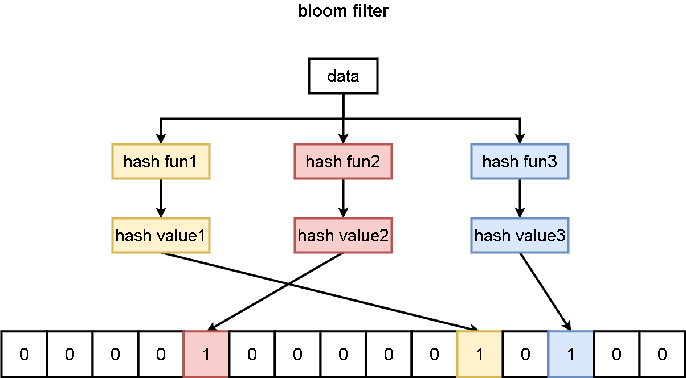

# bloomfilter代码走读


# 概述

布隆过滤器是一种用于判断给定数据是否在集合中的方法。在许多语言中，我们会使用hashtable来记录一个数据集合。布隆过滤器实际上也是类似的，只不过我们不需要存储数据，而仅仅存储表示数据是否存在的标志位即可。因此我们可以创建一个字节序列，对于给定的数据，我们将进行哈希运算后的哈希值作为索引，并将对应字节序列对应索引处的bit置为1。

当然我们只要使用hash映射，不可避免地会遇到哈希冲突。布隆过滤器解决哈希冲突的方法是我们对同一个数据计算多个不同地哈希函数得到多个哈希值，如k个。并将k个哈希值作为索引对k个不同bit置位。这样我们判断某一个数据是否存在的方式就是判断这k个bit是否置位，只有同时被置位才表明数据可能存在。

注意由于哈希冲突的原因，即便我们使用多个哈希函数来降低冲突，仍然不能消除冲突。因此即便k个bit都为1，也只是可能存在。但是如果k个bit中有一个为0，那么表示此数据一定不存在。

下面是布隆过滤器的基本原理示意图：




# 误报率计算

假设Hash函数以等概率选择并设置bits array中某一位。m是bits array大小，或者说bit数，k是哈希函数个数。则某一位在一个元素插入时进行的一次哈希操作没有置为“1”的概率是：

$$
1-\frac{1}{m}
$$

所有k次hash操作后某一位位没有置“1”的概率是：

$$
(1-\frac{1}{m})^k
$$

插入n个元素后，某一位没有置“1”的概率是：

$$
(1-\frac{1}{m})^{kn}
$$

因此某一位为1的概率是：

$$
1-(1-\frac{1}{m})^{kn}
$$

现在对于某一个不在该集合中的元素进行检查，有可能k个位置都为1，即产生误检。误检的概率为：

$$
(1-(1-\frac{1}{m})^{kn})^k
$$

由于

$$
\lim\limits_{x\rightarrow\infty} (1-\frac{1}{m})^m = \frac{1}{e}
$$

m因为是数组大小，通常我们取一个较大值，因此可以认为m区域无穷。因此可以将误检（假阳性率）概率表示为：

$$
(1-e^{\frac{-kn}{m}})^k
$$


我们可以得到一些基本结论。当m增加，假阳性概率下降。当n增加，假阳性概率上升。

至于哈希函数个数太多太少都可能增加假阳性概率，太少时不同key很容易映射到bit array同一位置。太多会导致bits array中1的个数过多，也会导致增加误检。

对于给定的m和n，如何选择hash函数个数k。只需要将m，n看作常量然后对k的函数求最值即可。最终结果为：

$$
\frac{m}{n}ln2
$$

而给定假阳性率p，m如何确定：

$$
m=-\frac{nlnp}{(ln2)^2}
$$

# 一个基本的bloom filter

## 数据结构


```go
// Filter是将key编码后的[]byte类型集合
type Filter []byte
```


## hash函数


这里使用Murmur hash算法实现

```go
// hash算法，近似Murmur hash
func Hash(b []byte) uint32 {
	const (
		seed = 0xbc9f1d34
		m    = 0xc6a4a793
	)
	h := uint32(seed) ^ uint32(len(b))*m
	for ; len(b) >= 4; b = b[4:] {
		h += uint32(b[0]) | uint32(b[1])<<8 | uint32(b[2])<<16 | uint32(b[3])<<24
		h *= m
		h ^= h >> 16
	}
	switch len(b) {
	case 3:
		h += uint32(b[2]) << 16
		fallthrough
	case 2:
		h += uint32(b[1]) << 8
		fallthrough
	case 1:
		h += uint32(b[0])
		h *= m
		h ^= h >> 24
	}
	return h
}
```

## 确定参数

这里使用上述公式计算bitsPerKey。这里的bitsPerKey指的是filter的bits array长度（bit数）m与插入的key数量n的比值。即m/n。

```go
// 由给定的假阳性率计算bloom filter的bitsPreKey（m/n）
func BloomBitsPerKey(numEntries int, fp float64) int {
	size := -1 * float64(numEntries) * math.Log(fp) / math.Pow(float64(0.69314718056), 2)
	locs := math.Ceil(size / float64(numEntries))
	return int(locs)
}
```


## 创建过滤器

这里布隆过滤器最少为1个字节（8bit），最多为30字节。同时过滤器需要多留一个字节记录hash函数个数k的值。这个值在查找某个key是否存在时会用到。

```go
// 返回一个新的bloom filter包含keys集合到bits的映射
// 一个好的bitsPerKey值是10，这会产生一个假阳性率约为1%的滤波器。
func NewFilter(keys []uint32, bitsPerKey int) Filter {
	return Filter(appendFilter(keys, bitsPerKey))
}

func appendFilter(keys []uint32, bitsPerKey int) []byte {
	if bitsPerKey < 0 {
		bitsPerKey = 0
	}
	// 0.69近似ln2
	k := uint32(float64(bitsPerKey) * 0.69)
	if k < 1 {
		k = 1
	}
	if k > 30 {
		k = 30
	}

	nBits := len(keys) * int(bitsPerKey)

	//对于小的len(keys)，有很高的假阳性率，通过设定最小filter长度修复这个问题
	if nBits < 64 {
		nBits = 64
	}
	nBytes := (nBits + 7) / 8
	nBits = nBytes * 8               //向上取整
	filter := make([]byte, nBytes+1) //加1是为了在最后一个字节记录k值

	for _, h := range keys { //将所有key加入filter
		h = Hash(uint32ToBytes(h)) //计算hash
		delta := h>>17 | h<<15
		for j := uint32(0); j < k; j++ { //计算k次hash并设置filter对应位
			bitPos := h % uint32(nBits)
			filter[bitPos/8] |= 1 << (bitPos % 8)
			h += delta
		}
	}

	//记录bloom filter的k值
	filter[nBytes] = uint8(k)

	return filter
}

func uint32ToBytes(n uint32) []byte {
	data := n
	bytebuf := bytes.NewBuffer([]byte{})
	binary.Write(bytebuf, binary.BigEndian, data)
	return bytebuf.Bytes()
}
```


## 检查key是否存在

检查key的操作和初始化过滤器操作基本一致

```go
func (f Filter) MayContainKey(k []byte) bool {
	return f.MayContain(Hash(k))
}

// 返回filter是否存在给定的key，可能出现假阳性（返回true，实际没有出现）
func (f Filter) MayContain(h uint32) bool {
	if len(f) < 2 {
		return false
	}
	k := f[len(f)-1] //filter最后一个字节保存的是k（hash函数个数）
	if k > 30 {
		// 这是为短bloom filter潜在新编码保留的
		// 当作一次匹配
		return true
	}
	nBits := uint32(8 * (len(f) - 1))
	delta := h>>17 | h<<15
	for j := uint8(0); j < k; j++ {
		bitPos := h % nBits
		if f[bitPos/8]&(1<<(bitPos%8)) == 0 {
			return false
		}
		h += delta
	}
	return true
}
```

