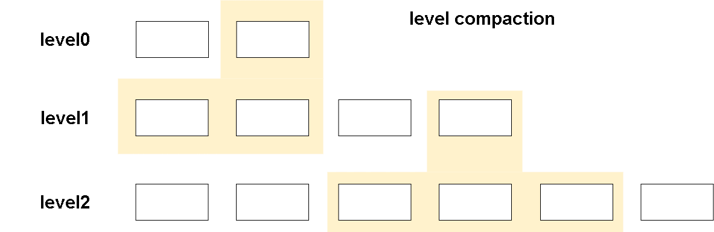
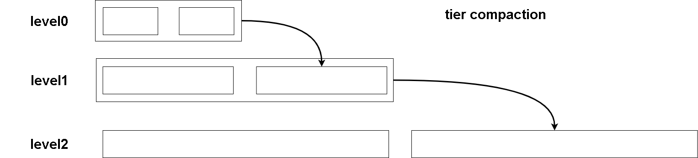
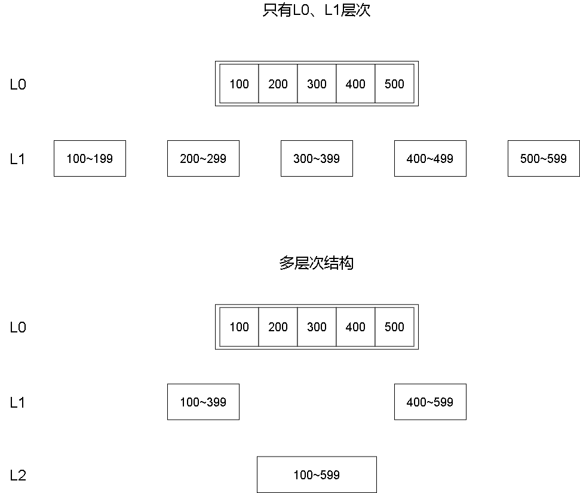

# compact

# 概述

compact可能是LSM-tree中最为复杂的操作了。本节我们将详细介绍有关LSM-tree的compact操作。我们会先介绍compact操作中有哪些需要考虑的问题。之后我们会给出有关compact操作的基本流程。在之后我们讨论一下compact中涉及的一些策略。最后我们介绍compact操作相关的基本组件及详细设计。最后我们将逐行解释compact操作的源代码。

首先我们要明确compact操作解决什么问题：

第一，如果没有所谓的compact，而只是将内存中到达上限的memtable持久化到磁盘，即以顺序写的方式追加数据。那么我们的读效率会严重下降，因为memtable之间无法保证数据的有序性。因此最起码我们应该对L0层的数据进行归并排序并放置在L1层。

第二，如果未来我们的KV引擎需要支持事务，那么有可能对于每个key我们都保存了许多不同的版本，我们需要有一种策略能够定期删除过老的版本，同时我们希望键值对entry有有效时间，我们也需要定期清除过期数据。那么compact实际上就是在压缩这些数据。

# compact操作

首先LSM-tree主流compact策略分为两类Level compaction和Tier/Size Compaction。

在这之前我们先介绍`run`的概念，每一个run都表示按索引键排序的数据，可以表示单个文件，也可以表示范围不重叠的文件集合。

Level compaction在disk中维持了多个层次的sstable。为什么需要多个层次我们下面再解释。而每一层我们都维护唯一的run，即每一层的所有sstable数据是全局有序的。下面是level ompaction的合并方式。

我们每一个挑选Ln层的若干sstable作为被合并的表，我们简称为“合并表”。然后在Lm层寻找与合并表的索引键范围重合的sstable，我们称为“目标表”。level compaction就是将这些Ln层这些合并表合并到Lm层这些目标表中。因此level compaction每一层总是有序的。当然在初始情况下Lm层没有任何表，那我们会直接将Ln层若干表直接归并到Lm层。

Tier compaction相比level compaction简单得多。tier compaction每一层可能会有多个run，即存在sstable之间可能存在重叠的索引键范围。下面是tier compaction合并方式。

我们不断flush到L0层小的sstable，如果数量足够多，就将这些sstable打包合并到下一层。每一层以此类推。

这两种compact策略有什么不同呢？
- level compaction合并后的数据更为有序，因此读性能更好。
- 与之相对的是level compaction的合并操作相对而言更加复杂，因此写效率并不高。但是需要注意的是我们的compact操作是在后台运行的，并不会直接影响到数据库的读写效率。
- 同时level compaction由于合并操作更为频繁，tier compaction只是在文件数量足够多时进行一次合并而已。因此这有利于减少空间放大。

我们的实现中就是采用了level compaction方法。

# compact需要考虑的问题

在确定我们compact大体策略后，我们需要探讨一些更为细节的问题。

## level中sst的组织

首先，我们应该如何组织disk中的sstable呢？应该分几层存储sstable，每层应存储多少sstable？

首先在已有的许多KV引擎中实现的LSM-tree都有一定的层次结构。前面我们说L0层为了保证写入效率直接将内存中的memtable追加写入。但是这会极大影响读性能，因为这些sstable中索引键是无序的，因此最差情况下我们需要遍历所有的sstable读取其中数据。因此我们需要将L0层sstable归并排序到L1层。

那么我们需要L2、L3...层吗？从功能上来说并不是必须的，但是想象一下我们在进行合并操作的过程中实际上会对所有需要合并的sstable进行一次遍历读写。如果我们只有L0和L1层，那么几乎所有数据都被堆积到L1层，那么每次我们要将L0层的数据合并到L1层需要遍历的数据量会非常大，这会造成读写放大问题。因此我们将插入一些中间层来缓解读写放大的问题。下面这张图解释了插入中间层为什么可以缓解读写放大。简单来说如果全将数据堆积到同一层次，由于数据量巨大，那么相同距离的索引键可能跨越了不同文件。那么我们对L0文件合并时需要读取所有这些文件。但是如果我们组织成多层次结构，L1中相对而言数据量更小，那么相同距离的索引键可能都位于同一文件，那么我们合并时只需遍历更少的文件，这大大减少了读写放大。

另一方面如果我们的层次过多，实际上也会导致不必要的写放大问题，因为我们可能需要将数据从L0写入L1，L1写入L2，以此类推。

因此对于sstable的层次组织的设计是一个trade-off问题。这是一个偏研究型的问题，有许多论文都对此进行讨论。在我们的实现中将设计L0~L6层层次结构，并在合并过程中维持每一层之间的大小比例为10，即L1层sstable大小总和为L0层10倍，依次递增。而每一层的sst文件大小则以2倍递增。由这个比例构成的每一层的数据大小被称为`目标大小`

>批注：trade-off：折中

## 如何选择sst

首先我们规定一些术语。首先我们将每一次执行合并操作相关的信息称为一个`合并计划（compactDef）`，合并计划中记录的最重要的信息就是我们在这一次合并中要将哪个层级的哪些表合并到哪个层的那些表中。

我们将那些被合并的sstable称之为`合并表`，所谓被合并就是将数据从当前层移动到更高的层级的那些sstable。而合并表位于的层级我们称为`合并层`。我们将那些更高层级的与`合并表`数据进行合并的sstable称为`目标表`，可以视为我们的合并过程就是将合并表“融入”目标表，同样的`目标表`所在层级被称为`目标层`。

于是我们可以将一个合并计划的制定分为两个步骤：首先确定合并层和目标层，其次确定合并表和目标表。

在讲解如何选择合并表和目标表之前我们先区分一下不同层进行合并的目的：
- 对于L0层，其合并的最终目的是使数据有序以减少读放大。
- 对于Lmax层，所谓Lmax就是最下面一层。如果我们的sst层次结构一共有0~6层，那么L6就是Lmax。其合并的最终目的是压缩数据，丢弃过期数据与无效数据。
- 对于其他层，其压缩目的主要是进行效率的trade-off，即我们需要在L0和Lmax之间形成一定层次结构进行过渡。

**确定目标层**

对于目标层选取，如果是非L0和Lmax层的合并表，其直接合并到下一层即可。我们主要讨论L0层的合并表应该合并到哪一层。

在上文我们提到我们需要将sstable组织成一个多层结构，但是如果层数过多那么会造成严重的写放大问题，即一份数据我们可能需要依次从L0一直写到Lmax。那么解决这一问题的方法就是允许跨层合并。即对于L0层数据我们不一定只合并到L1层，我们可以一次性合并到L6层，这能够大大缓解写放大问题。因此我们获得目标层的第一准则就是：

- 从下向上选择何时的层作为目标层，优选下层。

另外我们上文提到sst层次结构中每一层数据大小是按固定比例组织的。同时对于每一层数据量我们应该有一个最小值的度量。那么如果某一层Ln数据量过少，就会导致其上层Ln-1等层次数据量达不到最小标准。那我们应该优先将数据合并到Ln层。
- 以每一层数据量作为标准，优先选择数据量小的层。

**确定合并层**

合并层同样是根据我们目标数据量大小与实际数据量大小来确定的。目标大小约大，合并优先级越低，实际数据量越小，合并优先级越高。

我们会优先选择合并优先级高的层进行合并。

**确定合并表&目标表**

这一部分策略是最为复杂的。我们会分为以下几种情况分别分析：
- L0到Lbase层的合并
- L0到L0层的合并
- Lmax到Lmax层的合并
- Ln到Ln+1层的合并

首先我们介绍L0到Lbase层的合并。Lbase层就是我们在上文中提到的选取的目标层。

对于L0层的合并，主要目的使数据有序以减少读放大。因此L0层选择合并表的条件就是找到一系列索引键相互重叠的sstable进行合并，当然我们应该优先选择旧文件，因为旧文件与其他文件重叠的概率更大。在我们的代码中我们将合并表构成的序列称为top，将top中所有合并表的索引键分布范围记为thisRange。那么Lbase层的目标表就是与thisRange索引键范围重叠的那些sstable。

除了L0到Lbase层的压缩外，我们还可以支持L0层到L0层的压缩。L0层同层压缩的主要目的除了是数据有序外还可以大大减少L0层sstable的数量，同样可以起到提高查询性能的目的。

L0层同层合并并不区分合并表和目标表，通常我们选择的标准是：大小较小，因为对于过大表的合并可能会阻塞查询。同时创建时间足够长的表。创建时间过短的表可能是那些正在从memtable写入sstable的表。

然后我们介绍Lmax到Lmax层的合并。

与L0层合并目的不同，Lmax层的合并仅仅是为了压缩数据，去除那些已经到达过期时间的数据。因此Lmax同层合并的选择标准是：过期数据量大，创建时间长的表。

最后对于Ln到Ln+1层的合并，我们单纯的选取Ln层最旧的表作为合并表，那么目标表就是Ln+1层与合并表索引键重叠的那些sstable。

## 合并执行

根据上文描述的选取合并sst的规则，我们可以构建出一个真正的合并计划，其中指明了我们应该将哪些合并表合并到目标表中。合并的过程起始就是构建sstable的过程。我们只需要创建一个tableBuilder对象，同时将所有合并表、目标表构成一个MergeIterator。然后不断使用MergeIterator遍历所有数据并插入tableBuilder中即可。最后我们将构建好的tableBuilder用于创建新的sstable文件，同时获得对应的table对象。

除此之外我们还要记得更新manifest文件信息。我们要注意在删除合并表和目标表之前一定要先更新manifest。

最后我们更新levelHandler信息，这将会在levelHandler中增加对新创建table对象的引用，减少对旧的table的引用。同时这意味着旧table会被删除。即便没有删除，我们的manifest文件已经被更新，下一次数据库启动时也会清除失效的sst文件。

## 并发执行与并发控制

最后我们来谈一谈如何使用并发来提高compact的执行效率。

