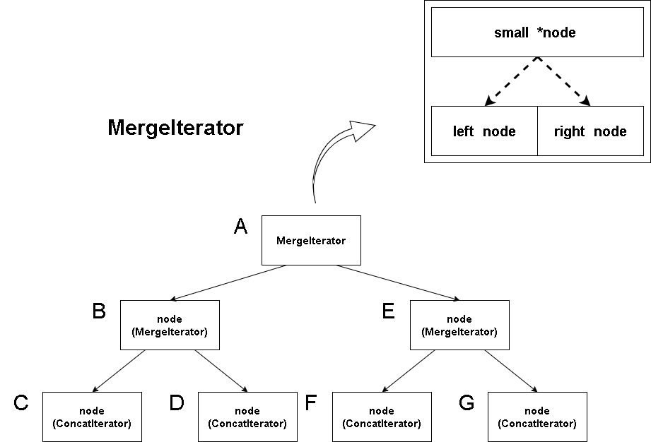

# iterator


# 概述


iterator可以说贯穿整个LSM-tree。我们在memtable、table中都曾介绍过对应的iterator。而本节我们将介绍LSM的iterator，其本质上就是一个聚合了memtable以及table对应iterator的列表，同时封装了对应的iterator接口方法。

另外我们还提供了两个新的迭代器类型，相比于之前的memtable、table迭代器只是简单的提供对已有数据结构的遍历操作。那么这两个新的迭代器类型则为我们抽象出更复杂的功能。这两个迭代器分别是ConcatIterator和MergeIterator。

ConcatIterator简单来说就是将一些iterator串联。它的用于是为每一层的sst文件的迭代器进行进一步的抽象与封装，用于将某一层的sst文件对应tableIterator串联在一起。这很容易理解，当我们要在某一层查找某个key是否存在时，当然需要一个迭代器能够帮助查找一整层的sst文件。当然，这里ConcatIterator并不会用作处理第0层的sst文件，因为第0层sst文件是无序的。

MergeIterator则是将ConcatIterator组织成二叉树的结构。为什么要这么做呢？在我们使用merge操作将同一层次的sst文件进行合并时，需要使用归并排序。假如我们有4个文件，那么我们需要遍历全部4个文件进行归并排序。再假如我们按key递增排序，那么排序过程中我们总是需要维护一个指向当前4个文件中未归并数据中key最小的。4个文件中最小key需要我们两两比较才能获得，因此我们干脆将迭代器组织成二叉树的形式：




我们进一步解释上图中关于MergeIterator的设计。首先看到图中的二叉树由一些node组成，node并不是抽象的概念，在代码中我们也会实现一个node结构体，它的目的是提供关于MergeIterator和ConcatIterator的抽象，即一个node既可以表示ConcatIterator也可以表示MergeIterator。更进一步的，只有当node是叶子节点时才会表示ConcatIterator，否则表示MergeIterator。

我们再来看MergeIterator的构成。其有三个重要组件，一个是左右节点node，上面说过node就表示一个iterator。然后是一个指向迭代器的指针small。如果我们想要使用MergeIterator按升序遍历所有数据，那么在迭代器移动过程中，small指向的就是当前左右node中迭代器指向key更小的哪一个。

有了这些基本概念之后我们再来看MergeIterator构成的二叉树。其中箭头表示的含义实际上是被指向的节点node属于指出的对象。即A中包含node B和node E，node B包含node C和node D，以此类推。这样我们就清楚了，在某一时刻node B中的MergeIterator中small指向的起始是node C和node D中当前key更小的那个ConcatIterator，node E同理。而对于最上层的MergeIterator A呢？其small指向的实际上就是底层C、D、F、G的ConcatIterator中最小的那个。


# LSM-tree迭代器及其他迭代器封装


这里是所有迭代器的封装，包括LSM-tree迭代器、memtable迭代器以及levelManager的迭代器。levelManager见其专门讲解。

不再赘述

```go
type Iterator struct {
	it    Item             //entry的封装
	iters []utils.Iterator //符合Iterator接口的迭代器列表
}

type Item struct {
	e *utils.Entry
}

// Item获取entry
func (it *Item) Entry() *utils.Entry {
	return it.e
}

// 创建LSM迭代器（一个迭代器列表），传入iterator的选项Options（和文件Options不是同一个）
// 注意这是LSM的方法
func (lsm *LSM) NewIterators(opt *utils.Options) []utils.Iterator {
	iter := &Iterator{}
	iter.iters = make([]utils.Iterator, 0)
	iter.iters = append(iter.iters, lsm.memTable.NewIterator(opt)) //第一个iter为memtable的
	for _, imm := range lsm.immutables {                           //接下来是inmutables
		iter.iters = append(iter.iters, imm.NewIterator(opt))
	}
	iter.iters = append(iter.iters, lsm.levels.iterators()...) //接下来为sstable
	return iter.iters
}

// Iterator中memtable迭代器的Next
func (iter *Iterator) Next() {
	iter.iters[0].Next()
}

// Iterator中memtable迭代器的Valid
func (iter *Iterator) Valid() bool {
	return iter.iters[0].Valid()
}

// Iterator中memtable迭代器的Rewind
func (iter *Iterator) Rewind() {
	iter.iters[0].Rewind()
}

// Iterator中memtable迭代器的Item
func (iter *Iterator) Item() utils.Item {
	return iter.iters[0].Item()
}

// Iterator中memtable迭代器的Close
func (iter *Iterator) Close() error {
	return nil
}

// Iterator中memtable迭代器的Seek
func (iter *Iterator) Seek(key []byte) {
}

// memtable迭代器
type memIterator struct {
	innerIter utils.Iterator
}

// 创建memtable迭代器，本质上就是skiplist的迭代器
func (m *memTable) NewIterator(opt *utils.Options) utils.Iterator {
	return &memIterator{innerIter: m.sl.NewSkipListIterator()}
}

// memtable迭代器的Next
func (iter *memIterator) Next() {
	iter.innerIter.Next()
}

// memtable迭代器的Valid
func (iter *memIterator) Valid() bool {
	return iter.innerIter.Valid()
}

// memtable迭代器的Rewind
func (iter *memIterator) Rewind() {
	iter.innerIter.Rewind()
}

// memtable迭代器的Item
func (iter *memIterator) Item() utils.Item {
	return iter.innerIter.Item()
}

// memtable迭代器的Close
func (iter *memIterator) Close() error {
	return iter.innerIter.Close()
}
func (iter *memIterator) Seek(key []byte) {
}

// levelManager上的迭代器
type levelIterator struct {
	it    *utils.Item
	iters []*Iterator
}

// 创建levelManager上的迭代器
func (lm *levelManager) NewIterators(options *utils.Options) []utils.Iterator {
	return lm.iterators()
}

// levelIterator迭代器的Next
func (iter *levelIterator) Next() {

}

// levelIterator迭代器的Valid
func (iter *levelIterator) Valid() bool {
	return false
}

// levelIterator迭代器的Rewind
func (iter *levelIterator) Rewind() {

}

// levelIterator迭代器的Item
func (iter *levelIterator) Item() utils.Item {
	return &Item{}
}

// levelIterator迭代器的Close
func (iter *levelIterator) Close() error {
	return nil
}

// levelIterator迭代器的Seek
func (iter *levelIterator) Seek(key []byte) {

}
```

# ConcatIterator


## 数据结构

正如上文所说ConcatIterator是一个tableIterator的迭代器序列。被用在代表某一层sst的迭代器。

```go
// ConcatIterator将table数组链接成一个迭代器，这样迭代效率更高
type ConcatIterator struct {
	idx     int              // 哪个迭代器处于活动状态
	cur     utils.Iterator   //等价为iters[idx]
	iters   []utils.Iterator // 对应sstable
	tables  []*table         // 忽略反转，这是按升序排列的
	options *utils.Options   // 有效选项为REVERSED和NOCACHE
}

// NewConcatIterator创建一个新的串联迭代器
func NewConcatIterator(tbls []*table, opt *utils.Options) *ConcatIterator {
	iters := make([]utils.Iterator, len(tbls)) //iters初始为空列表，使用时创建
	return &ConcatIterator{
		options: opt,
		iters:   iters,
		tables:  tbls,
		idx:     -1, // Not really necessary because s.it.Valid()=false, but good to have.
	}
}
```


## setIdx

setIdx用于将ConcatIterator当前指向的tableIterator设置为第idx个table的。这是一个重要的辅助函数，在下面迭代器接口中被多次调用。

```go
// ConcatIterator当前迭代器指向第idx个table的迭代器，没有的话就创建
func (s *ConcatIterator) setIdx(idx int) {
	s.idx = idx
	if idx < 0 || idx >= len(s.iters) {
		s.cur = nil
		return
	}
	if s.iters[idx] == nil {
		s.iters[idx] = s.tables[idx].NewIterator(s.options)
	}
	s.cur = s.iters[s.idx]
}
```


## Seek

Seek分为两步：
- 首先定位key属于哪个table，并指向对应的tableIterator
- 其次当前指向tableIterator的Seek

```go
// ConcatIterator的Seek。如果IsAsc，我们新指向的entry.key >= key。否则entry.key <= key
func (s *ConcatIterator) Seek(key []byte) {

	/* 下面查找tables的索引idx，使得key位于tabls[idx]的table中 */
	var idx int
	if s.options.IsAsc { //如果升序，从前向后找到第一个table满足maxKey>=key。
		idx = sort.Search(len(s.tables), func(i int) bool {
			return utils.CompareKeys(s.tables[i].ss.MaxKey(), key) >= 0
		})
	} else { //如果降序，从后向前找到第一个table满足minKey<=key
		n := len(s.tables)
		idx = n - 1 - sort.Search(n, func(i int) bool {
			return utils.CompareKeys(s.tables[n-1-i].ss.MinKey(), key) <= 0
		})
	}

	if idx >= len(s.tables) || idx < 0 {
		s.setIdx(-1)
		return
	}

	s.setIdx(idx)   //ConcatIterator指向idx对应table
	s.cur.Seek(key) //idx对应table的tableIterator指向key
}
```


## Next

Next分为两步：
- 首先直接调用指向的tableIterator的Next，如果有效直接返回，否则执行下一步
- 向后移动，使用setIdx指向下一个table的tableIterator，判断是否有效

```go
// ConcatIterator的Next
func (s *ConcatIterator) Next() {
	s.cur.Next() //当前指向table的tableIterator的Next
	if s.cur.Valid() {
		return
	}
	for { // 如果当前迭代器无效
		if !s.options.IsAsc { //批注：这里是不是写反了？？？？
			s.setIdx(s.idx + 1)
		} else {
			s.setIdx(s.idx - 1)
		}
		if s.cur == nil { //无效table索引，valid为false
			return
		}
		s.cur.Rewind()
		if s.cur.Valid() {
			break
		}
	}
}
```


## 其他接口

这是ConcatIterator其他的Iterator接口方法，不再赘述。

```go
// ConcatIterator的Rewind
func (s *ConcatIterator) Rewind() {
	if len(s.iters) == 0 {
		return
	}
	if !s.options.IsAsc {
		s.setIdx(0)
	} else {
		s.setIdx(len(s.iters) - 1)
	}
	s.cur.Rewind()
}

// ConcatIterator的Valid
func (s *ConcatIterator) Valid() bool {
	return s.cur != nil && s.cur.Valid()
}

// ConcatIterator的Item
func (s *ConcatIterator) Item() utils.Item {
	return s.cur.Item()
}

// ConcatIterator的Close
func (s *ConcatIterator) Close() error {
	// 循环管理iters中所有tableIterator
	for _, it := range s.iters {
		if it == nil {
			continue
		}
		if err := it.Close(); err != nil {
			return fmt.Errorf("ConcatIterator:%+v", err)
		}
	}
	return nil
}
```

# node


## 数据结构

上文解释过node是对ConcatIterator和MergeIterator的抽象。其中包含一个Iterator接口，但是为了对分别对两种Iterator调用其特有操作，因此其中分别包含了ConcatIterator和MergeIterator指针，用于指向Iterator对象。

```go
type node struct {
	valid bool
	entry *utils.Entry
	iter  utils.Iterator //只是iterator接口类型，实际会被转换为下面merge或concat进行操作

	//这两个迭代器是从iter中使用type assertion获得的，用于内联更多函数调用
	// 在具体类型上调用函数要比调用接口函数快得多（约25%~30%）
	merge  *MergeIterator
	concat *ConcatIterator
}

// 设置iter并从iter中type assertion获得merge或concat
func (n *node) setIterator(iter utils.Iterator) {
	n.iter = iter

	// 如果下面type assertion失败，并且n.merge/n.concat被置为nil也没关系
	// 我们在所有方法中处理merge和concat的nil值
	// 批注：iter要么是其他普通iterator，要么是MergeIterator，要么是ConcatIterator，所以至少有一个为nil
	n.merge, _ = iter.(*MergeIterator)
	n.concat, _ = iter.(*ConcatIterator)
}
```


## 迭代器接口封装

下面是node封装的其中Iterator的接口。

```go
// 迭代器节点node从有效的iterator中获取entry
// 批注：不理解为什么函数名叫setKey？？？
func (n *node) setKey() {
	switch {
	case n.merge != nil:
		n.valid = n.merge.small.valid
		if n.valid {
			n.entry = n.merge.small.entry
		}
	case n.concat != nil:
		n.valid = n.concat.Valid()
		if n.valid {
			n.entry = n.concat.Item().Entry()
		}
	default:
		n.valid = n.iter.Valid()
		if n.valid {
			n.entry = n.iter.Item().Entry()
		}
	}
}

// 迭代器节点node向后移动并更新entry
func (n *node) next() {
	switch {
	case n.merge != nil:
		n.merge.Next()
	case n.concat != nil:
		n.concat.Next()
	default:
		n.iter.Next()
	}
	n.setKey()
}

// 迭代器节点rewind
func (n *node) rewind() {
	n.iter.Rewind()
	n.setKey()
}

// 迭代器节点seek
func (n *node) seek(key []byte) {
	n.iter.Seek(key)
	n.setKey()
}
```

# MergeIterator


## 数据结构

上面已经介绍过MergeIterator主要成员了，这里不再赘述。

```go
// MergeIterator 多路合并迭代器
// 注意：MergeIterator拥有迭代器数组并负责关闭他们
type MergeIterator struct {
	left  node
	right node
	small *node //small指向我们当前按序遍历的那个node

	curKey  []byte //记录当前key，为了判断是否遇到相同key不同版本
	reverse bool
}

// 创建一个新的MergeIterator
func NewMergeIterator(iters []utils.Iterator, reverse bool) utils.Iterator {
	switch len(iters) {
	case 0:
		return &Iterator{}
	case 1:
		return iters[0]
	case 2:
		mi := &MergeIterator{
			reverse: reverse,
		}
		mi.left.setIterator(iters[0])
		mi.right.setIterator(iters[1])
		// 暂时初始化small为左迭代器，在rewind/seek时会被修复
		mi.small = &mi.left
		return mi
	}
	// 下面将传入的iters列表中所有迭代器组织成一个平衡二叉树的形式的MergeIterator。
	mid := len(iters) / 2
	return NewMergeIterator(
		[]utils.Iterator{
			NewMergeIterator(iters[:mid], reverse),
			NewMergeIterator(iters[mid:], reverse),
		}, reverse)
}
```


## fix修正small

MergeIterator主要用于对sst文件做merge操作的。因此在升序排列的情况下，small应该始终指向当前迭代器树中所有迭代器指向key最小的那个迭代器。fix函数就是用于保证small正确性的。fix是所有与移动迭代器相关的接口都要用到的辅助方法，每次迭代器定位到新的位置总是需要fix修正。

另外我们看到这里实现中迭代器不仅可以升序，也可以降序排列。这与迭代器的reverse成员取值有关。在降序排列中small显然应该总是指向当前最大的key对应迭代器。因此small这一名称并不准确，实际上不论是递增或递减small代表的都是当前按序应该访问的位置。


```go
// fix修复small指向的迭代器
// 注意small并不是总是指向left和right中key更小的那个迭代器，这与遍历顺序相关
func (mi *MergeIterator) fix() {
	if !mi.bigger().valid { //大迭代器无效
		return
	}
	if !mi.small.valid { //小迭代器无效
		mi.swapSmall() //small设置为另一个
		return
	}
	cmp := utils.CompareKeys(mi.small.entry.Key, mi.bigger().entry.Key) //比较小迭代器和大迭代器的key
	switch {
	case cmp == 0: // 两个迭代器key相等
		// 右侧迭代器向前移动
		mi.right.next()
		if &mi.right == mi.small {
			mi.swapSmall()
		}
		return
	case cmp < 0: // 小迭代器更小
		if mi.reverse { //如果逆序，则small应该指向大迭代器
			mi.swapSmall()
		} else {
			// 不用做任何事
		}
		return
	default: // 大迭代器更小
		if mi.reverse { //如果逆序，small指向大迭代器
			// 不用做任何事
		} else {
			mi.swapSmall()
		}
		return
	}
}

// 返回左右迭代器node更大的那个
func (mi *MergeIterator) bigger() *node {
	if mi.small == &mi.left {
		return &mi.right
	}
	return &mi.left
}

// 将当前非small的迭代器赋给small
func (mi *MergeIterator) swapSmall() {
	if mi.small == &mi.left {
		mi.small = &mi.right
		return
	}
	if mi.small == &mi.right {
		mi.small = &mi.left
		return
	}
}
```


## 迭代器移动接口Next/Rewind/Seek

下面是一组迭代器移动的方法，无一例外移动后需要调用fix。

另外Next方法中对于相同的key会忽略掉，只保留第一个。这也是为什么MergeIterator中包含一个curKey成员。setCurrent方法则是用来更新当前的curKey。

```go
// MergeIterator的Next，返回下一元素，如果和当前key相等，忽略它
func (mi *MergeIterator) Next() {
	for mi.Valid() {
		if !bytes.Equal(mi.small.entry.Key, mi.curKey) {
			break
		}
		mi.small.next()
		mi.fix()
	}
	mi.setCurrent()
}

// MergeIterator的Rewind，seek到第一个entry（或这对于反向迭代器，指向最后一个）
func (mi *MergeIterator) Rewind() {
	mi.left.rewind()
	mi.right.rewind()
	mi.fix()
	mi.setCurrent()
}

// MergeIterator的Seek，指向key使得key>=给定的key
// 批注：实际上要看迭代器是否是反向的，反向迭代器Seek指向entry.key <= key
func (mi *MergeIterator) Seek(key []byte) {
	mi.left.seek(key)
	mi.right.seek(key)
	mi.fix()
	mi.setCurrent()
}

// 设置当前的key为small指向的entry的key
func (mi *MergeIterator) setCurrent() {
	utils.CondPanic(mi.small.entry == nil && mi.small.valid == true, fmt.Errorf("mi.small.entry is nil"))
	if mi.small.valid {
		mi.curKey = append(mi.curKey[:0], mi.small.entry.Key...)
	}
}
```


## 其他接口方法


```go
// MergeIterator的Valid
func (mi *MergeIterator) Valid() bool {
	return mi.small.valid
}

// MergeIterator的Item
func (mi *MergeIterator) Item() utils.Item {
	return mi.small.iter.Item()
}

// MergeIterator的Close
func (mi *MergeIterator) Close() error {
	err1 := mi.left.iter.Close()
	err2 := mi.right.iter.Close()
	if err1 != nil {
		return utils.WarpErr("MergeIterator", err1)
	}
	return utils.WarpErr("MergeIterator", err2)
}
```

