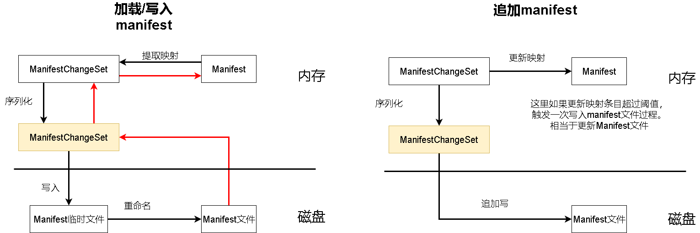
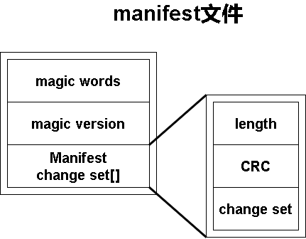

# manifest


# 为什么需要manifest

manifest用于维护sst文件的元信息。这里元信息主要是指sst文件以及其层级的映射关系。所以其中还暗含了当前LSM-tree包含了哪些sst文件。

那么为什么需要单独维护一个manifest文件，而不是将sst的层级信息记录在sst文件内部呢？

当我们初始化数据库时需要将sst相关信息包括层级信息加载到内存中方便之后的数据库操作。如果我们将sst层级信息放在每个sst文件内部，那么加载它们需要依次读取所有sst文件并提取信息。相对更加耗时。而使用单独的manifest文件保存sst信息，使得数据库初始化过程更快速。


# manifest的设计思路

首先不像sst文件我们将部分内存分别序列化并自行组装后再写入磁盘文件。manifest文件所有数据将被直接全部序列化后进行存储。这是因为manifest文件只是记录元信息，相对sst文件大小很小。另外我们总是加载一整个manifest文件到内存中，而不像sst文件一样分块加载。

当我们LSM-tree中sst文件层级信息发生变化时，如何更新manifest文件呢？

一种直观的方法是每次都读取manifest文件，然后反序列化，修改manifest数据，最后写入。但是这种做法无疑是相当耗时的。应对这个问题的一贯做法是使用追加写的方式写入manifest。但是如果总是追加，manifest文件会越来越大，我们加载manifest文件到内存速度也会变慢。因此当追加内容达到一定数量，则重新将内存中manifest信息刷入磁盘，即更新manifest文件。

我们直接来看以下manifest文件的操作示意图：




# ManifestFile


## 数据结构


```go
// ManifestFile 维护sst文件元信息的文件
// manifest 比较特殊，不能使用mmap，需要保证实时的写入
type ManifestFile struct {
	opt                       *Options
	f                         *os.File //manifest文件句柄
	lock                      sync.Mutex
	deletionsRewriteThreshold int
	manifest                  *Manifest
}

// Manifest 元数据状态维护
type Manifest struct {
	Levels    []levelManifest          //level到table id映射
	Tables    map[uint64]TableManifest //table id到level映射
	Creations int
	Deletions int
}

type levelManifest struct {
	Tables map[uint64]struct{} // table id 集合
}

// TableManifest包含sst的基本信息
type TableManifest struct {
	Level    uint8  // sst层级
	Checksum []byte // 方便今后扩展
}
```


## 加载manifest文件

加载manifest文件时需要判断是否存在manifest文件，如果不存在会创建一个新的空manifest对象以及空manifest文件。如果存在则会将manifest文件信息加载到manifest对象中。

```go
// 创建一个空的manifest文件
func createManifest() *Manifest {
	levels := make([]levelManifest, 0)
	return &Manifest{
		Levels: levels,
		Tables: make(map[uint64]TableManifest),
	}
}
```

```go
// 打开manifest文件
func OpenManifestFile(opt *Options) (*ManifestFile, error) {
	path := filepath.Join(opt.Dir, utils.ManifestFilename)
	mf := &ManifestFile{lock: sync.Mutex{}, opt: opt}
	f, err := os.OpenFile(path, os.O_RDWR, 0)

	// 如果打开失败
	if err != nil {
		if !os.IsNotExist(err) {
			return mf, err
		}
		// 创建一个新的 manifest file对象
		m := createManifest()
		// 将manifest文件写入磁盘
		fp, netCreations, err := helpRewrite(opt.Dir, m)
		utils.CondPanic(netCreations == 0, errors.Wrap(err, utils.ErrReWriteFailure.Error()))
		if err != nil {
			return mf, err
		}
		mf.f = fp
		mf.manifest = m
		return mf, nil
	}

	// 如果打开 则对manifest文件重放
	manifest, truncOffset, err := ReplayManifestFile(f)
	if err != nil {
		_ = f.Close()
		return mf, err
	}
	// truncOffset指向的是文件中完整的ManifestChangeSet偏移量，我们将不完整的数据截断
	if err := f.Truncate(truncOffset); err != nil {
		_ = f.Close()
		return mf, err
	}
	if _, err = f.Seek(0, io.SeekEnd); err != nil {
		_ = f.Close()
		return mf, err
	}
	mf.f = f
	mf.manifest = manifest
	return mf, nil
}
```

当manifest文件存在时，通过ReplayManifestFile函数解析manifest文件并返回manifest对象。Manifest文件的存储格式如下图所示：




```go
type bufReader struct {
	reader *bufio.Reader
	count  int64
}

func (r *bufReader) Read(p []byte) (n int, err error) {
	n, err = r.reader.Read(p)
	r.count += int64(n)
	return
}

// ReplayManifestFile 对已经存在的manifest文件重新应用所有状态变更
func ReplayManifestFile(fp *os.File) (ret *Manifest, truncOffset int64, err error) {
	/* 下面读取manifest文件并校验magic words和magic version */
	//创建给定文件句柄的reader
	r := &bufReader{reader: bufio.NewReader(fp)}

	//reader读取magic words和magic version并进行校验
	var magicBuf [8]byte
	if _, err := io.ReadFull(r, magicBuf[:]); err != nil {
		return &Manifest{}, 0, utils.ErrBadMagic
	}
	if !bytes.Equal(magicBuf[0:4], utils.MagicText[:]) {
		return &Manifest{}, 0, utils.ErrBadMagic
	}
	version := binary.BigEndian.Uint32(magicBuf[4:8])
	if version != uint32(utils.MagicVersion) {
		return &Manifest{}, 0,
			fmt.Errorf("manifest has unsupported version: %d (we support %d)", version, utils.MagicVersion)
	}

	/* 下面将manifest文件内容反序列化到manifest对象中 */
	//创建一个空manifest对象
	build := createManifest()
	var offset int64
	//批注：注意这里是循环读取，意味着文件中有不止一个ManifestChangeSet的序列化对象。
	for {
		offset = r.count //我们每成功读取一个ManifestChangeSet才会更新offset
		var lenCrcBuf [8]byte
		/* 下面读取changeBuf长度和校验和到lenCrcBuf */
		_, err := io.ReadFull(r, lenCrcBuf[:])
		if err != nil {
			if err == io.EOF || err == io.ErrUnexpectedEOF {
				//读到文件描述符
				break
			}
			return &Manifest{}, 0, err
		}
		length := binary.BigEndian.Uint32(lenCrcBuf[0:4])

		/* 下面读取changeBuf到buf并进行CRC校验 */
		var buf = make([]byte, length)
		if _, err := io.ReadFull(r, buf); err != nil {
			if err == io.EOF || err == io.ErrUnexpectedEOF {
				break
			}
			return &Manifest{}, 0, err
		}
		if crc32.Checksum(buf, utils.CastagnoliCrcTable) != binary.BigEndian.Uint32(lenCrcBuf[4:8]) {
			return &Manifest{}, 0, utils.ErrBadChecksum
		}
		/* 下面反序列化changeBuf并重新解析出table到level数据赋予manifest对象 */
		var changeSet pb.ManifestChangeSet
		if err := changeSet.Unmarshal(buf); err != nil {
			return &Manifest{}, 0, err
		}

		if err := applyChangeSet(build, &changeSet); err != nil {
			return &Manifest{}, 0, err
		}
	}

	return build, offset, err
}
```

ReplayManifestFile循环解析所有change set块。上文我们已经提到过在我们为manifest追加数据时，实际上会向manifest文件追加一个序列化的change set。因此一个manifest文件中有多个change set。我们需要将所有change set加载进来，恢复当前sst和level的映射关系。

下面我们给出ManifestChangeSet在proto中的定义。能够看到ManifestChangeSet是由ManifestChange构成。一个ManifestChange表示的就是一条sst到level的映射关系：

```
message ManifestChangeSet {
        // A set of changes that are applied atomically.
        repeated ManifestChange changes = 1;
}

message ManifestChange {
        uint64 Id = 1;
        enum Operation {
                CREATE = 0;
                DELETE = 1;
        }
        Operation Op   = 2;
        uint32 Level   = 3; // Only used for CREATE
        bytes Checksum = 4; // Only used for CREATE
}
```

下面是applyChangeSet方法来解析change set：

```go
// 从changeSet中解析table到level映射数据到manifest对象build中
// 如果manifest文件被损坏将返回错误，这个错误是不可恢复的
func applyChangeSet(build *Manifest, changeSet *pb.ManifestChangeSet) error {
	for _, change := range changeSet.Changes {
		if err := applyManifestChange(build, change); err != nil {
			return err
		}
	}
	return nil
}

func applyManifestChange(build *Manifest, tc *pb.ManifestChange) error {
	switch tc.Op {
	case pb.ManifestChange_CREATE: //表示创建一个table到level映射
		if _, ok := build.Tables[tc.Id]; ok {
			return fmt.Errorf("MANIFEST invalid, table %d exists", tc.Id)
		}
		build.Tables[tc.Id] = TableManifest{
			Level:    uint8(tc.Level),
			Checksum: append([]byte{}, tc.Checksum...),
		}
		for len(build.Levels) <= int(tc.Level) {
			build.Levels = append(build.Levels, levelManifest{make(map[uint64]struct{})})
		}
		build.Levels[tc.Level].Tables[tc.Id] = struct{}{}
		build.Creations++
	case pb.ManifestChange_DELETE: //表示删除一个table到level映射
		tm, ok := build.Tables[tc.Id]
		if !ok {
			return fmt.Errorf("MANIFEST removes non-existing table %d", tc.Id)
		}
		delete(build.Levels[tm.Level].Tables, tc.Id)
		delete(build.Tables, tc.Id)
		build.Deletions++
	default:
		return fmt.Errorf("MANIFEST file has invalid manifestChange op")
	}
	return nil
}
```


## 写入manifest文件


在数据库初始化时我们需要加载manifest文件，如果manifest文件不存在，我们则需要在磁盘创建一个空的manifest文件，即向磁盘写入空的manifest文件。另外上面提到我们使用追加的方式记录sst和level的映射关系，当累积到一定程度，我们需要重写manifest文件。helpRewrite方法就是用于将manifest对象写入manifest文件的。

```go
// 将manifest数据序列化写入磁盘，返回对应manifest文件以及sst文件数
func helpRewrite(dir string, m *Manifest) (*os.File, int, error) {
	rewritePath := filepath.Join(dir, utils.ManifestRewriteFilename)
	// 我们显式sync
	//打开文件manifest文件
	fp, err := os.OpenFile(rewritePath, utils.DefaultFileFlag, utils.DefaultFileMode)
	if err != nil {
		return nil, 0, err
	}

	/* 下面操作从manifest序列化并构建manifest文件内容，存入buf */
	//magic words和magic version写入buf
	buf := make([]byte, 8)
	copy(buf[0:4], utils.MagicText[:])
	binary.BigEndian.PutUint32(buf[4:8], uint32(utils.MagicVersion))

	// 将manifest中table到level映射信息表示为ManifestChangeSet并序列化为changeBuf
	netCreations := len(m.Tables)
	changes := m.asChanges()
	set := pb.ManifestChangeSet{Changes: changes}

	changeBuf, err := set.Marshal()
	if err != nil {
		fp.Close()
		return nil, 0, err
	}

	//将changeBuf长度和校验和写入lenCrcBuf
	var lenCrcBuf [8]byte
	binary.BigEndian.PutUint32(lenCrcBuf[0:4], uint32(len(changeBuf)))
	binary.BigEndian.PutUint32(lenCrcBuf[4:8], crc32.Checksum(changeBuf, utils.CastagnoliCrcTable))

	//将buf、lenCrcBuf、changeBuf拼接为完整的buf
	buf = append(buf, lenCrcBuf[:]...)
	buf = append(buf, changeBuf...)

	/* 下面操作将manifest写入磁盘并重命名 */
	//将buf数据写入磁盘
	if _, err := fp.Write(buf); err != nil {
		fp.Close()
		return nil, 0, err
	}
	if err := fp.Sync(); err != nil {
		fp.Close()
		return nil, 0, err
	}

	// 在Windows中重命名操作前要先关闭文件
	if err = fp.Close(); err != nil {
		return nil, 0, err
	}
	manifestPath := filepath.Join(dir, utils.ManifestFilename)
	if err := os.Rename(rewritePath, manifestPath); err != nil {
		return nil, 0, err
	}
	fp, err = os.OpenFile(manifestPath, utils.DefaultFileFlag, utils.DefaultFileMode)
	if err != nil {
		return nil, 0, err
	}
	if _, err := fp.Seek(0, io.SeekEnd); err != nil {
		fp.Close()
		return nil, 0, err
	}
	if err := utils.SyncDir(dir); err != nil {
		fp.Close()
		return nil, 0, err
	}

	return fp, netCreations, nil
}
```

加载manifest和写入manifest文件可以视为一对逆过程。唯一需要注意的是写入manifest文件会先写入一个临时文件，然后再使用rename替换旧的manifest文件。这么做是为了防止manifest文件写入失败。

同样helpRewrite中调用asChanges来将manifest对象中映射关系提取出来转换为change set（实际上是ManifestChange的序列）。

```go
// 返回一系列更改，这些更改可用于在当前状态下重新创建Manifest。
func (m *Manifest) asChanges() []*pb.ManifestChange {
	// 将manifest中table到level映射map信息，存储为ManifestChange序列。
	// 每个ManifestChange表示一个table到level的映射
	changes := make([]*pb.ManifestChange, 0, len(m.Tables))
	for id, tm := range m.Tables {
		changes = append(changes, newCreateChange(id, int(tm.Level), tm.Checksum))
	}
	return changes
}

// 创建manifestChange
func newCreateChange(id uint64, level int, checksum []byte) *pb.ManifestChange {
	return &pb.ManifestChange{
		Id:       id,
		Op:       pb.ManifestChange_CREATE,
		Level:    uint32(level),
		Checksum: checksum,
	}
}
```


## 追加写入manifest

追加写入manifest过程只是简单的构建一个change set并将其序列化后的内容追加到manifest文件即可。与此同时change set内容也会被同步到manifest内存对象中，这会记录下manifest当前映射的变化条目，如果变化条目过多则会触发一次重写。

```go
// AddChanges 对外暴露的写比那更丰富
func (mf *ManifestFile) AddChanges(changesParam []*pb.ManifestChange) error {
	return mf.addChanges(changesParam)
}

func (mf *ManifestFile) addChanges(changesParam []*pb.ManifestChange) error {

	//将新增ChangeSet序列化
	changes := pb.ManifestChangeSet{Changes: changesParam}
	buf, err := changes.Marshal()
	if err != nil {
		return err
	}

	// TODO 锁粒度可以优化
	mf.lock.Lock()
	defer mf.lock.Unlock()
	// ChangeSet数据加入manifest对象
	if err := applyChangeSet(mf.manifest, &changes); err != nil {
		return err
	}

	// 如果manifest删除映射满足一定条件，我们应该立即全部重写manifest到磁盘
	// 否则我们只是将序列化的ChangeSet追加写入manifest文件
	if mf.manifest.Deletions > utils.ManifestDeletionsRewriteThreshold &&
		mf.manifest.Deletions > utils.ManifestDeletionsRatio*(mf.manifest.Creations-mf.manifest.Deletions) {
		if err := mf.rewrite(); err != nil {
			return err
		}
	} else {
		var lenCrcBuf [8]byte
		binary.BigEndian.PutUint32(lenCrcBuf[0:4], uint32(len(buf)))
		binary.BigEndian.PutUint32(lenCrcBuf[4:8], crc32.Checksum(buf, utils.CastagnoliCrcTable))
		buf = append(lenCrcBuf[:], buf...)
		if _, err := mf.f.Write(buf); err != nil {
			return err
		}
	}
	err = mf.f.Sync()
	return err
}
```

rewrite方法用于重写manifest文件，它本质上就是调用helpRewrite方法。

```go
// 显式将ManifestFile中的manifest对象写入磁盘
// 必须在保持appendLock时调用。
func (mf *ManifestFile) rewrite() error {
	// In Windows the files should be closed before doing a Rename.
	if err := mf.f.Close(); err != nil {
		return err
	}
	fp, nextCreations, err := helpRewrite(mf.opt.Dir, mf.manifest)
	if err != nil {
		return err
	}
	mf.manifest.Creations = nextCreations
	mf.manifest.Deletions = 0
	mf.f = fp
	return nil
}
```

## 校验manifest文件


我们除了维护sst文件的元信息，还需要定期检查这些sst文件的变化。清除一些不需要的sst文件。RevertToManifest方法用于检查manifest和当前所有sst文件的差异。

```go
// 检查所有必要的表文件，并且移除所有没有被manifest引用的表文件。
// idMap是从目录中读取的表文件id
func (mf *ManifestFile) RevertToManifest(idMap map[uint64]struct{}) error {

	// 如果manifest包含的sst表不存在，报错
	for id := range mf.manifest.Tables {
		if _, ok := idMap[id]; !ok {
			return fmt.Errorf("file does not exist for table %d", id)
		}
	}

	// 如果sst存在的表manifest中不包含，删除
	for id := range idMap {
		if _, ok := mf.manifest.Tables[id]; !ok {
			utils.Err(fmt.Errorf("Table file %d  not referenced in MANIFEST", id))
			filename := utils.FileNameSSTable(mf.opt.Dir, id)
			if err := os.Remove(filename); err != nil {
				return errors.Wrapf(err, "While removing table %d", id)
			}
		}
	}
	return nil
}
```


## 其他方法


```go
// AddTableMeta 存储level表到manifest的level中
func (mf *ManifestFile) AddTableMeta(levelNum int, t *TableMeta) (err error) {
	mf.addChanges([]*pb.ManifestChange{
		newCreateChange(t.ID, levelNum, t.Checksum),
	})
	return err
}

// Close 关闭文件
func (mf *ManifestFile) Close() error {
	if err := mf.f.Close(); err != nil {
		return err
	}
	return nil
}

// GetManifest manifest
func (mf *ManifestFile) GetManifest() *Manifest {
	return mf.manifest
}
```


