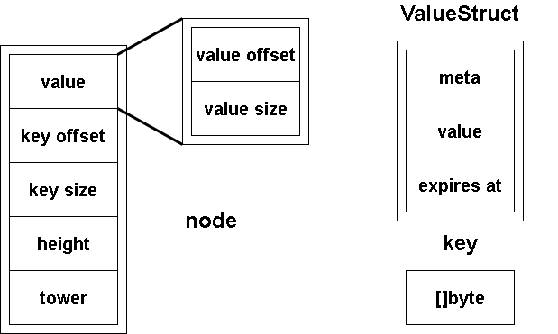
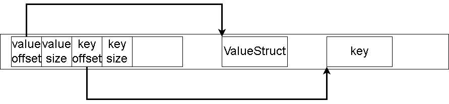

# arena代码走读


# why 内存池

主要从时间效率和空间效率两部分考虑。

对于时间效率，如果每次都向操作系统申请内存很耗时。但这一点通常并不成立。因为语言提供的内存分配操作底层实现并不是单纯的系统调用，而是在那之上做了封装，如提供了内存池供应用层使用。通常效率并不低。

对于空间效率，空间效率的提升可以分为两部分：

一部分是使用系统自带的内存分配函数通常每一块内存都会有payload，即额外的信息用于组织分配的内存。而我们将一些小的内存请求组织成大的内存块同一申请能够有效减少payload占用空间。

第二部分是由于系统提供的分配操作不区分业务逻辑，因此不同种类请求的内存混杂在一起更容易出现内存碎片。因此在空间效率上来说为自己应用提供一个单独的内存池有好处的。

而这里的内存池实际上主要就是针对LSM tree体系中的memtable，或者更准确地说是skiplist中存储的entry数据。

# arena内存池

arena内存池是借鉴levelDB中内存池的设计。其本质上就是一个线性内存块，内存管理策略类似于vector，当内存池空间不够用时使用2倍扩容的方式增加内存块大小，并将旧的数据拷贝到新内存块中。

另外我们的arena内存池并不提供释放内存操作，这是因为LSM-tree中数据总是以追加方式写入的，不会有缩小内存的情况。当我们的skiplist中数据足够多需要刷写到内存中时，我们直接整块释放内存池即可。


# 新的ValueStruct

使用内存池之后的skiplist相应也要进行改变。特别是基本数据结构node、key和value。在之前的skiplist中，key和value全部都在node中。在支持内存池后可以将node和key、value分开存储。node中只记录key、value数据在内存池中偏移量即可。

对于key，只是一个整型或字节序列。这里不再赘述。对于value，我们重新实现为ValueStruct。对于node则在下面重构skiplist中详细介绍。

## 数据结构

```go
type ValueStruct struct {
	Meta      byte   //元数据
	Value     []byte //数据
	ExpiresAt uint64 //过期时间

	Version uint64 // 此字段未序列化，仅供内部使用
}
```


## 对value编码


value通常包含数据较多，为了节省空间，我们可以为value进行编码。主要针对value的ExpiresAt字段，我们可以使用varint编码。

varint编码是一种变长编码。一个32位（4字节）整型经过varint编码后可能为1~5字节。编码后的每个字节首位被标记为有效位，有效位为1表示后面字节还属于当前数据，有效位为0表示这是数据最后一个字节。其他位则表示正常数据。

具体而言，对于数字123456，二进制为11110001001000000，我们将其7位一组进行分割：111 1000100 1000000。那么按小段字节序，从低到高字节编码为：11000000 11000100 0111。

下面函数求取value编码后的大小：

```go
// value只持久化具体的value值和过期时间
func (vs *ValueStruct) EncodedSize() uint32 {
	sz := len(vs.Value) + 1 // meta
	enc := sizeVarint(vs.ExpiresAt)
	return uint32(sz + enc)
}

func sizeVarint(x uint64) (n int) {
	for {
		n++
		x >>= 7
		if x == 0 {
			break
		}
	}
	return n
}
```

下面代码对value进行编码和解码：

```go
// 对value解码
func (vs *ValueStruct) DecodeValue(buf []byte) {
	vs.Meta = buf[0]
	var sz int
	vs.ExpiresAt, sz = binary.Uvarint(buf[1:])
	vs.Value = buf[1+sz:]
}

// 对value进行编码，并将编码后的字节写入byte
// 这里将过期时间和value的值一起编码
func (vs *ValueStruct) EncodeValue(b []byte) uint32 {
	b[0] = vs.Meta
	sz := binary.PutUvarint(b[1:], vs.ExpiresAt) //对ExpiresAt使用varint变长编码
	n := copy(b[1+sz:], vs.Value)
	return uint32(1 + sz + n)
}
```


# 一个基本的arena内存池

我们skiptable的特点是只增加数据和修改，不删除数据。因此在内存池中只需要不断向后追加数据即可。这种情况下我们无需对内存池进行复杂的设计，只需要一大块线性内存即可。

上面已经介绍了ValueStruct和key的形式。除了ValueStruct的Version字段是供内部使用不进行存储，其他字段则和上面介绍的一致。在我们介绍内存池之前先看一下内存池中需要存储的这几个数据结构以及在内存池中的大致形式：

下面是ValueStruct，key以及skiplist中node节点的构成：



node节点会在下文重构skiplist中介绍，但简单来说node中并不记录对应数据的key和value，而只是记录key和value在arena内存池中的位置（offset）。因此一个skiplist的node在内存池中形式是这样的：




## 数据结构


```go
const (
	offsetSize = int(unsafe.Sizeof(uint32(0)))

	//始终64位对齐，即使在32位机器上。因此node.value也是64位对齐的
	//这是必要的，因为node.getValueOffset使用atomic.LoadUint32，期望输入指针64位对齐
	nodeAlign = int(unsafe.Sizeof(uint64(0))) - 1

	MaxNodeSize = int(unsafe.Sizeof(node{})) //node最大大小
)

// Arena是无锁的
type Arena struct {
	n          uint32 //内存池偏移量
	shouldGrow bool   //内存是是否应该增长
	buf        []byte
}
```

nodeAlign变量是为了将内存中node地址做64位（8字节）对齐使用到的常量，这里nodeAlign值为7。给定node地址nodeAddr，我们将其对齐到8的倍数只需要(nodeAddr+nodeAlign)& ^nodeAlign即可。为了将nodeAddr置为8的倍数我们需要将其最后3位抹零，也就是&^nodeAlign操作。但是我们应该求的是大于nodeAddr的8的倍数，因此需要先(nodeAddr+nodeAlign)。如此nodeAddr对应地址值总是8字节的倍数，也就是64位对齐。

## 分配内存

```go
// 返回新arena.
func newArena(n int64) *Arena {

	//不要在0字节存放数据，保留offset=0作为nil pointer
	out := &Arena{
		n:   1,
		buf: make([]byte, n),
	}
	return out
}

// 分配sz大小内存并返回偏移量
func (s *Arena) allocate(sz uint32) uint32 {
	offset := atomic.AddUint32(&s.n, sz)
	if !s.shouldGrow {
		AssertTrue(int(offset) <= len(s.buf))
		return offset - sz
	}

	//我们在最后保留了额外的字节，因此checkptr不会失败
	//我们只将节点的tower保持在有效高度，而不是最大高度。这减少了节点大小
	//但是checkptr不知道减小的大小
	if int(offset) > len(s.buf)-MaxNodeSize {
		growBy := uint32(len(s.buf))
		if growBy > 1<<30 { //新增内存不要太大（超过1GB）
			growBy = 1 << 30
		}
		if growBy < sz { //新增内存不要太小
			growBy = sz
		}
		newBuf := make([]byte, len(s.buf)+int(growBy))
		AssertTrue(len(s.buf) == copy(newBuf, s.buf))
		s.buf = newBuf
	}
	return offset - sz
}

func (s *Arena) size() int64 {
	return int64(atomic.LoadUint32(&s.n))
}
```

前面说arena是无锁的。因此allocate方法中对内存池已使用内存指针修改是使用原子操作实现的。

分配内存时当内存不够，如果空间允许增长，那么按照两倍的比例扩充内存池大小。

skiplist中节点包含指向其他各层节点指针的切片（tower成员），因此tower大小是不固定的。为了节省空间，我们会按照节点所处的skiplist高度确定tower的大小并申请对应大小的节点，而不会按照skiplist最大高度确定tower成员的大小。

但是当我们从内存池中获取指向节点的指针时并不知道节点有多大。因此为了保证指向节点的指针被解析时的地址总是arena中有效地址。我们为内存池始终多保留一个MaxNodeSize内存空间。


## 放入数据

```go
// 在arena中分配一个节点，节点在内存偏移量被返回
func (s *Arena) putNode(height int) uint32 {

	// tower长度不会使用maxHeight，因为height比maxHeight低
	unusedSize := (maxHeight - height) * offsetSize

	// 内存对齐
	l := uint32(MaxNodeSize - unusedSize + nodeAlign) //当前内存池offset要么已经对齐，要么要补至多nodeAlign才对齐。
	n := s.allocate(l)

	// 返回对齐的偏移量
	m := (n + uint32(nodeAlign)) & ^uint32(nodeAlign)
	return m
}

// 将val副本放入arena。返回内存偏移量。
// 用户负责记录val的大小
func (s *Arena) putVal(v ValueStruct) uint32 {
	l := uint32(v.EncodedSize())
	offset := s.allocate(l)
	v.EncodeValue(s.buf[offset:])
	return offset
}

func (s *Arena) putKey(key []byte) uint32 {
	keySz := uint32(len(key))
	offset := s.allocate(keySz)
	buf := s.buf[offset : offset+keySz]
	AssertTrue(len(key) == copy(buf, key))
	return offset
}
```

putNode方法和putVal、putKey方法略微不同，putNode并不真正的向内存池插入一个node节点，而只是在内存池中分配对应的空间。如果想要给内存池中的node赋值，那么可以通过下面getNode方法获取对应node指针。之所以这么设计是因为key和value都是由从skiplist接口外部输入进来的，要存储在skiplist中的数据，因此可以直接写入内存池中。而node是我们内部维护的数据结构，应该直接从内存池构建。

putVal使用EncodeValue将给定的value值编码后写入对应内存池的内存空间中。


## 取出数据

从内存中取得key和value具有类似的调用方式，传入offset和size。

getNode和getNodeOffset是一对兄弟方法。一个用于通过offset获取节点指针。一个用于通过节点指针获取offset。因此可以认为这两者是等价的。

```go
// 返回指向给定偏移量的node指针，如果偏移量是零，nil被返回
func (s *Arena) getNode(offset uint32) *node {
	if offset == 0 {
		return nil
	}
	return (*node)(unsafe.Pointer(&s.buf[offset]))
}

// 返回偏移量处的字节切片
func (s *Arena) getKey(offset uint32, size uint16) []byte {
	return s.buf[offset : offset+uint32(size)]
}

// 返回偏移量处的字节切片，给定大小应该只是值大小，不包括meta byte
func (s *Arena) getVal(offset uint32, size uint32) (ret ValueStruct) {
	ret.DecodeValue(s.buf[offset : offset+size])
	return
}

// 返回node在arena中偏移量，如果node指针是nil，则返回0
func (s *Arena) getNodeOffset(nd *node) uint32 {
	if nd == nil {
		return 0 //返回空指针
	}
	//implement me here！！！
	//获取某个节点,在 arena 当中的偏移量
	//unsafe.Pointer等价于void*,uintptr可以专门把void*的对于地址转化为数值型变量
	return uint32(uintptr(unsafe.Pointer(nd)) - uintptr(unsafe.Pointer(&s.buf[0])))
}

// 断言b为真，否则将log fatal
func AssertTrue(b bool) {
	if !b {
		log.Fatalf("%+v", errors.Errorf("Assert failed"))
	}
}
```


# skiplist重构

引入内存池之后我们需要对旧的skiplist相关代码进行改动。基本上相当于重写skiplist。

## node数据结构和方法

下面是node结构体定义。可以看到其中key和value都只保存对应内存池中偏移量。height记录node高度，前面说过了node中指向下一节点的指针切片tower为了节省空间，会按照节点的高度申请对应大小。因此需要height记录节点高度。这里尽管我们看到tower是长度是maxHeight，但我们并不会真的申请这么多空间，同时对node解析时也不会真正解析超过height的数据。另外height高度是从1开始的。也就是说位于skiplist最底层的height为1。


另外值得注意的是value字段包含了value offset和value size两部分。之所以将这两部分合并是因为value是可变的。当我们对于同一个ket进行插入操作时，实际上会更新value的值。为了在并发情况下更方便的使用原子操作更新value，因此我们将这两个字段进行合并。同时我们提供用于从value解码获得value offset和value size以及编码的函数：


```go
const (
	maxHeight      = 20
	heightIncrease = math.MaxUint32 / 3
)

type node struct {

	// 值的多个部分被编码为单个uint64，以便可以原子地加载和存储：
	//   value offset: uint32 (bits 0-31)
	//   value size  : uint16 (bits 32-63)
	value uint64

	// A byte slice is 24 bytes. We are trying to save space here.
	keyOffset uint32 // 不变的，无需锁定即可访问
	keySize   uint16 // 不变的，无需锁定即可访问

	// tower高度
	height uint16

	// 所有对元素的访问都应该使用CAS操作，无需锁定。（CAS比较并交换）
	tower [maxHeight]uint32
}
```

下面是将node中value进行编解码的操作，注意和上文中ValueStruct的编解码方法区分开。这里是对node中存储的value偏移量和大小进行编解码。

```go
// value offset（uint32）和value size（uint16）编码为uint64
func encodeValue(valOffset uint32, valSize uint32) uint64 {
	return uint64(valSize)<<32 | uint64(valOffset)
}

// 解码value offset和value size
func decodeValue(value uint64) (valOffset uint32, valSize uint32) {
	valOffset = uint32(value)
	valSize = uint32(value >> 32)
	return
}
```

下面方法用于获取value、获取key以及更新value。key是没有更新这一操作的。

```go
// 获取value offset
func (n *node) getValueOffset() (uint32, uint32) {
	value := atomic.LoadUint64(&n.value)
	return decodeValue(value)
}

// 返回node中ValueStruct
func (n *node) getVs(arena *Arena) ValueStruct {
	valOffset, valSize := n.getValueOffset()
	return arena.getVal(valOffset, valSize)
}

// 设置value
func (n *node) setValue(arena *Arena, vo uint64) {
	atomic.StoreUint64(&n.value, vo)
}

// 获取key对应字节序列
func (n *node) key(arena *Arena) []byte {
	return arena.getKey(n.keyOffset, n.keySize)
}
```

下面方法用于从tower获取下一节点、更新tower。

casNextOffset使用CAS指令更新tower，之所以不像更新value那样直接使用原子操作是因为我们并不关心value原来值为多少，也不关心新value值为多少。但是对于tower的更新发生在节点插入时，因此如果当我们要在x节点与y节点（x.next）之间插入节点n。在插入节点之前如果有新的节点抢先插入，我们需要感知到这种变化。简单的说我们插入时需要同时判断x的下一个节点是否还是y。因此需要CAS指令判断。

```go
// 获取下一节点指针（offset）
func (n *node) getNextOffset(h int) uint32 {
	return atomic.LoadUint32(&n.tower[h])
}

// 使用比较并交换原语更新tower[h]
func (n *node) casNextOffset(h int, old, val uint32) bool {
	return atomic.CompareAndSwapUint32(&n.tower[h], old, val)
}
```

下面方法用于创建一个新节点：

```go
// 内存中创建新节点
func newNode(arena *Arena, key []byte, v ValueStruct, height int) *node {
	// 高度已经在节点中分配
	nodeOffset := arena.putNode(height)
	keyOffset := arena.putKey(key)
	val := encodeValue(arena.putVal(v), v.EncodedSize()) //将value放入arena获得offset，将offset和size编码到一起

	node := arena.getNode(nodeOffset)
	node.keyOffset = keyOffset
	node.keySize = uint16(len(key))
	node.height = uint16(height)
	node.value = val
	return node
}
```


## skiplist数据结构

这里height记录当前高度，跟node一样，也是从1开始计算的。记录height只是为了在遍历skiplist时从height开始，而不需要从maxHeight开始。

```go
type Skiplist struct {
	height     int32 // 当前高度
	headOffset uint32
	ref        int32
	arena      *Arena
	OnClose    func()
}

// 创建一个新的空skiplist，具有给定的arena内存池大小
func NewSkiplist(arenaSize int64) *Skiplist {
	arena := newArena(arenaSize)
	head := newNode(arena, nil, ValueStruct{}, maxHeight)
	ho := arena.getNodeOffset(head)
	return &Skiplist{
		height:     1,
		headOffset: ho,
		arena:      arena,
		ref:        1,
	}
}
```


## 成员获取方法

下面是一些简单的辅助函数用于获取skiplist成员

```go
// 返回给定node给定高度的下一节点
func (s *Skiplist) getNext(nd *node, height int) *node {
	return s.arena.getNode(nd.getNextOffset(height))
}

// 返回头节点
func (s *Skiplist) getHead() *node {
	return s.arena.getNode(s.headOffset)
}

// 返回高度
func (s *Skiplist) getHeight() int32 {
	return atomic.LoadInt32(&s.height)
}

// 返回skiplist在其内部arena使用内存大小
func (s *Skiplist) MemSize() int64 { return s.arena.size() }
```

## find函数

下面是两个find函数，findNear用于在整个skiplist寻找key相邻的节点。findSpliceForLevel用于在特定level寻找key相邻节点。

findNear函数在skiplist的搜索函数以及skiplist迭代器相关操作中被调用。

findNear函数相对复杂，需要单独说明。该函数可以寻找节点key值距离给定key值最近的节点。根据less和allowEqual参数该节点的key可以小于等于或大于给定key。


```go
// 寻找临近key的node节点
// 如果less=true，寻找节点node.key<key（allowEqual=false）或者node.key<=key（allowEqual=true）
// 如果less=false，寻找node.key>key（allowEqual=false）或者node.key>=key（allowEqual=true）
func (s *Skiplist) findNear(key []byte, less bool, allowEqual bool) (*node, bool) {
	x := s.getHead()
	level := int(s.getHeight() - 1)
	for {
		// 初始 x.key < key.
		next := s.getNext(x, level)
		// x.key < key < END OF LIST
		if next == nil {
			if level > 0 {
				// 可以进一步下降以接近末尾
				// 收缩next
				level--
				continue
			}
			// Level=0. 无法进一步下降，返回
			if !less {
				return nil, false
			}
			// 返回x，确保x不是head
			if x == s.getHead() {
				return nil, false
			}
			return x, false
		}

		nextKey := next.key(s.arena)
		cmp := CompareKeys(key, nextKey)
		// x.key < next.key < key. 继续右移
		if cmp > 0 {
			x = next
			continue
		}
		// x.key < key == next.key.
		if cmp == 0 {
			//可以等于
			if allowEqual {
				return next, true
			}
			// 希望 >，所以0层获得下一个更大key节点
			if !less {
				return s.getNext(next, 0), false
			}
			// 希望 <，不是0层，我们应该向下一层，更加靠近
			// 收缩next
			if level > 0 {
				level--
				continue
			}
			// 在0层，返回x
			if x == s.getHead() {
				return nil, false
			}
			return x, false
		}
		// x.key < key < next.key
		//收缩next
		if level > 0 {
			level--
			continue
		}
		// 在第0层，需要返回
		//希望 >，返回next
		if !less {
			return next, false
		}
		// 希望<，返回x
		if x == s.getHead() {
			return nil, false
		}
		return x, false
	}
}
```


上面代码非常繁琐。我们分情况解读。首先由于我们想要寻找key值前后的节点。因此我们给定节点x，并在查找过程中保持x.key\<key\<=x.next.key。于是如果在第0层，并且有x.key\<key\<=x.next.key。那么小于key的临近节点为x。如果key\<x.next.key那么大于key的临近节点为x.next，如果key=x.next.key，那么大于key的临近节点为x.next.next。

这里有两个条件，首先是保持x.key\<key\<x.next.key。因此当x.key\<x.next.key\<key时我们要向右继续遍历链表x=next，直到x.key\<key\<=x.next.key。

另一个条件是只有在第0层我们才能确定最邻近key的节点，在其他层由于不包含所有节点，我们都无法确认。所以当在非0层时有x.key\<key\<=x.next.key。我们因该继续缩小x和x.next范围。或者说让x增大一点或让x.next减小一点。增大x的方法我们已经有了，那就是x=next。怎么让x.next减小呢？只需要level--，即向下一层。此时取得的x.next要更接近x。

最后，如果key=x.next.key。我们要找大于key的临近节点无需一直迭代到第0层，只需要取x.next节点在第0层的next节点即可。


findSpliceForLevel函数主要在添加节点时获取新节点在每一层的前后相邻节点时使用。

```go
// 返回(outBefore, outAfter)，其中outBefore.key <= key <= outAfter.key
// before形参告诉我们哪里开始查找
// 如果我们找到了有相同键的节点，则返回outBefore = outAfter。否则outBefore.key < key < outAfter.key
func (s *Skiplist) findSpliceForLevel(key []byte, before uint32, level int) (uint32, uint32) {
	for {
		// Assume before.key < key.
		beforeNode := s.arena.getNode(before)
		next := beforeNode.getNextOffset(level)
		nextNode := s.arena.getNode(next)
		if nextNode == nil {
			return before, next
		}
		nextKey := nextNode.key(s.arena)
		cmp := CompareKeys(key, nextKey)
		// key = next.key
		if cmp == 0 {
			return next, next
		}
		// before.key < key < next.key. 这一层查找结束
		if cmp < 0 {
			return before, next
		}
		before = next // 在当前层向右移动
	}
}
```


## 添加节点

添加节点分为如下几个步骤：
- 通过对所有level调用findSpliceForLevel计算key的前后相邻节点prev和next，同时判断key是否已经存在，存在的话则直接更新（原子操作）。否则执行下面步骤
- 随机生成新节点高度值，更新skiplist的当前高度height
- 创建新节点x并从第零层开始插入新节点

节点在每一层的插入需要修改x的tower指针指向next以及prev的tower指针指向x。其中x到next指针修改的是新节点x，不存在并发问题。而prev到x指针由于要修改skiplist已有节点，因此需要用CAS指令控制并发。casNextOffset方法就是使用CAS指令修改prev节点tower，前面已经介绍过。如果CAS比较失败说明有节点抢先节点x插入了prev和next之间。我们不得不重新获取当前层新的prev和next，如果发现抢先插入的节点和x.key相同，那么直接更新即可，否则需要重新插入。


```go
// 生成随机高度
func (s *Skiplist) randomHeight() int {
	h := 1 //注意height从1开始
	for h < maxHeight && FastRand() <= heightIncrease {
		h++
	}
	return h
}

// 插入key-value对
func (s *Skiplist) Add(e *Entry) {

	// 由于允许覆盖，因此可能不需要创建新节点。甚至可能不需要增加高度。让我们推迟这些行动。
	key, v := e.Key, ValueStruct{
		Meta:      e.Meta,
		Value:     e.Value,
		ExpiresAt: e.ExpiresAt,
		Version:   e.Version,
	}

	/* 下面操作获得待插入key在每一层的前驱、后继节点prev和next。同时如果key存在则直接更新value */
	//注意这里prev和next的层数只计算到skiplist当前高度，如果新节点高度比skiplist当前高度高，那么prev和next是0
	listHeight := s.getHeight()
	var prev [maxHeight + 1]uint32
	var next [maxHeight + 1]uint32
	prev[listHeight] = s.headOffset
	//判断key是否已经存在，存在则直接更新value
	for i := int(listHeight) - 1; i >= 0; i-- {
		//使用高层加速低层（即每次使用findSpliceForLevel查找key时，从prev[i+1]开始）
		prev[i], next[i] = s.findSpliceForLevel(key, prev[i+1], i)
		if prev[i] == next[i] {
			vo := s.arena.putVal(v)
			encValue := encodeValue(vo, v.EncodedSize())
			prevNode := s.arena.getNode(prev[i])
			prevNode.setValue(s.arena, encValue)
			return
		}
	}

	/* 下面代码随机生成插入节点的height，并更新skiplist当前最大高度 */
	// 需要创建新节点
	height := s.randomHeight()
	x := newNode(s.arena, key, v, height)

	// 尝试通过CAS增加s.height
	listHeight = s.getHeight()
	for height > int(listHeight) {
		if atomic.CompareAndSwapInt32(&s.height, listHeight, int32(height)) {
			// Successfully increased skiplist.height.
			break
		}
		listHeight = s.getHeight()
	}

	// 我们从第0层开始插入节点
	for i := 0; i < height; i++ {
		for {
			if s.arena.getNode(prev[i]) == nil {
				AssertTrue(i > 1) // 第0层不可能出现
				// 我们没有计算这个级别的prev和next，因为height超出了listHeight
				// 对于这些层，列表是稀疏的，因此可以从head开始查找
				prev[i], next[i] = s.findSpliceForLevel(key, s.headOffset, i)
				// 有人在我们之前增加了相同的key。这只可能在第0层发生，但我们不在第0层。
				// 批注：在第零层发生的含义是插入节点总是从第0层开始的。如果有相同key已经插入，那么第0层就会发现
				AssertTrue(prev[i] != next[i])
			}
			x.tower[i] = next[i]
			pnode := s.arena.getNode(prev[i])
			if pnode.casNextOffset(i, next[i], s.arena.getNodeOffset(x)) {
				// 设法在prev[i]和next[i]之间插入x，转到下一级别
				break
			}

			// CAS失败，我们需要重新计算prev和next。
			// 重新搜索时，尝试使用不同level不太可能有帮助。因为prev[i]和next[i]之间不太可能插入大量节点
			prev[i], next[i] = s.findSpliceForLevel(key, prev[i], i)
			if prev[i] == next[i] { //有人提前插入相同key，这里插入变成更新
				AssertTruef(i == 0, "Equality can happen only on base level: %d", i)
				vo := s.arena.putVal(v)
				encValue := encodeValue(vo, v.EncodedSize())
				prevNode := s.arena.getNode(prev[i])
				prevNode.setValue(s.arena, encValue)
				return
			}
		}
	}
}
```


## 搜索节点

通过findNear函数，我们很容易在skiplist中找到对应key的节点。不再赘述

```go
// 获取key对应的value。如果找到相等或更早版本的相同key，返回有效的value
func (s *Skiplist) Search(key []byte) ValueStruct {
	n, _ := s.findNear(key, false, true) // 寻找>=key的节点
	if n == nil {
		return ValueStruct{}
	}

	nextKey := s.arena.getKey(n.keyOffset, n.keySize)
	if !SameKey(key, nextKey) { //key是否相等
		return ValueStruct{}
	}

	valOffset, valSize := n.getValueOffset()
	vs := s.arena.getVal(valOffset, valSize)
	return vs
}
```


## 迭代器相关

为了更方便的操作skiplist，我们还为skiplist定义了一个相关类型SkipListIterator。SkipList类型中一些方法也被用于SkipListIterator。如上文的findNear方法、以及下面的findLast方法：

```go
// 返回最后一个元素，如果是head，返回nil。所有find函数永远不会返回head节点
func (s *Skiplist) findLast() *node {
	n := s.getHead()
	level := int(s.getHeight()) - 1
	for {
		next := s.getNext(n, level)
		if next != nil { //next节点不为nil，向右遍历
			n = next
			continue
		}
		if level == 0 {
			if n == s.getHead() {
				return nil
			}
			return n
		}
		level-- //next节点为nil，向下一层遍历
	}
}

// 返回skiplist是否为空
func (s *Skiplist) Empty() bool {
	return s.findLast() == nil
}

```


# 迭代器


除了skiplist结构本身，我们还为skiplist实现了指定迭代器。实现迭代器是为了方便遍历skiplist。在时候实现中我们还会为sstable也实现迭代器，它们都遵循同一的接口：

```go
// Iterator 迭代器
type Iterator interface {
	Next()
	Valid() bool
	Rewind()
	Item() Item
	Close() error
	Seek(key []byte)
}
```


## 数据结构


```go
// skiplist对象上的迭代器
type SkipListIterator struct {
	list *Skiplist
	n    *node
}

// 返回skiplist迭代器，你需要Close()迭代器
func (s *Skiplist) NewSkipListIterator() Iterator {
	s.IncrRef()
	return &SkipListIterator{list: s}
}

// Close关闭迭代器
func (s *SkipListIterator) Close() error {
	s.list.DecrRef()
	return nil
}
```


## 获取数据

```go
// 如果迭代器位于有效节点，则Valid返回true。
func (s *SkipListIterator) Valid() bool { return s.n != nil }

// 返回当前位置的key
func (s *SkipListIterator) Key() []byte {
	return s.list.arena.getKey(s.n.keyOffset, s.n.keySize)
}

// 返回value
func (s *SkipListIterator) Value() ValueStruct {
	valOffset, valSize := s.n.getValueOffset()
	return s.list.arena.getVal(valOffset, valSize)
}
```

## 迭代器移动

```go
func (s *SkipListIterator) Rewind() {
	s.SeekToFirst()
}

// SeekToFirst将迭代器移动到skiplist第一个节点的位置
// 迭代器最终状态为Valid()，如果skiplist不为空
func (s *SkipListIterator) SeekToFirst() {
	s.n = s.list.getNext(s.list.getHead(), 0)
}

// SeekToLast将迭代器移动到skiplist最后一个节点的位置
// 迭代器最终状态为Valid()，如果skiplist不为空
func (s *SkipListIterator) SeekToLast() {
	s.n = s.list.findLast()
}

// 将迭代器移动到首个key>=target的节点
func (s *SkipListIterator) Seek(target []byte) {
	s.n, _ = s.list.findNear(target, false, true) // find >=.
}

// 将迭代器移动到首个key<=target的节点
func (s *SkipListIterator) SeekForPrev(target []byte) {
	s.n, _ = s.list.findNear(target, true, true) // find <=.
}

// 返回value的uint64形式
func (s *SkipListIterator) ValueUint64() uint64 {
	return s.n.value
}

// 前进到下一位置
func (s *SkipListIterator) Next() {
	AssertTrue(s.Valid())
	s.n = s.list.getNext(s.n, 0)
}

// 前移到上一位置
func (s *SkipListIterator) Prev() {
	AssertTrue(s.Valid())
	s.n, _ = s.list.findNear(s.Key(), true, false) // find <. No equality allowed.
}
```


## 其他

Item实际上是entry的封装，它与entry含义相同，但是专门用于迭代器：

```go
type Item interface {
	Entry() *Entry
}
```

```go
func (s *SkipListIterator) Item() Item {
	return &Entry{
		Key:       s.Key(),
		Value:     s.Value().Value,
		ExpiresAt: s.Value().ExpiresAt,
		Meta:      s.Value().Meta,
		Version:   s.Value().Version,
	}
}
```


# 并发控制

skiplist不适用锁进行并发控制，而是采用原子操作。其中涉及并发控制的资源有两个：
- arena内存池中记录当前内存池数据偏移量的offset，我们使用atomic.AddUint32实现偏移量的原子递增
- skiplist中新插入节点时指向新节点的指针，我们使用CAS指令实现无锁修改。


