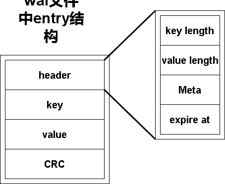

# wal


# 为什么需要wal


了解LSM-tree的整体架构就会知道，kv的插入首先是在内存中。我们之前已经实现了memtable，其驻留在内存中。因此随之而来的问题是如果kv引擎意外关闭，内存中数据都丢失了怎么办。这就需要我们引入恢复机制。

就像其他数据库一样，在我们插入数据的同时也会向磁盘写入日志用于数据恢复，这就是wal日志。

wal用于在将entry数据写入memtable的同时，将entry固化的磁盘中，以防发生异常内存中memtable数据丢失。因此wal主要提供两个操作：将entry追加到wal文件操作以及从wal文件依次加载所有entry的操作。

之后我们谈一谈wal文件基本运作。需要明确的是每一个wal文件都和一个memtable一一对应。因此每当我们对一个memtable写入entry数据时，都会先向wal文件同步写入数据。这样当数据库出现异常我们可以通过wal文件恢复数据。因此wal文件直接限制了数据库的写入性能。那么什么时候将wal文件删除呢。当我们把memtable刷写到磁盘就可以删除。

因此我们需要注意我们的wal文件并不需要类似mysql的redo log的checkpoint机制记录哪些数据被刷写到磁盘，哪些没有。

# wal文件构成

wal文件是entry数据的集合，一条entry包含了一个键值对。除此之外还包含了元信息，CRC校验信息等。wal文件中一条entry的格式如下图所示：




# WalFile


## 数据结构

WalFile是基于MmapFile实现的。

```go
// WalFile文件对象
type WalFile struct {
	lock    *sync.RWMutex
	f       *MmapFile     //wal使用mmap进行读写
	opts    *Options      //文件选项
	buf     *bytes.Buffer //临时存储entry字节序列，用于向mmap中追加数据
	size    uint32
	writeAt uint32
}
```

```go
// 初始化WalFile对象
func OpenWalFile(opt *Options) *WalFile {
	omf, err := OpenMmapFile(opt.FileName, os.O_CREATE|os.O_RDWR, opt.MaxSz)
	wf := &WalFile{f: omf, lock: &sync.RWMutex{}, opts: opt}
	wf.buf = &bytes.Buffer{}
	wf.size = uint32(len(wf.f.Data))
	utils.Err(err)
	return wf
}
```

这里的Options是文件选项对象。用于指定文件相关属性。


## 写入wal文件

Write实现了将entry数据追加写入wal文件操作。写入wal文件操作较为简单，只需要按照wal文件中entry格式计算好所有取值，序列化为字节序列并写入文件即可。

```go
// 将entry写入WalFile的mmap文件中
func (wf *WalFile) Write(entry *utils.Entry) error {
	// 落预写日志简单的同步写即可
	// 序列化为磁盘结构
	wf.lock.Lock()
	plen := utils.WalCodec(wf.buf, entry) //将entry编码后写入buf
	buf := wf.buf.Bytes()
	utils.Panic(wf.f.AppendBuffer(wf.writeAt, buf)) //将buf加入mmap文件。这和函数会刷鞋脏页到磁盘
	wf.writeAt += uint32(plen)
	wf.lock.Unlock()
	return nil
}
```

其中WalCodec方法将entry编码为字节序列写入buf中：

```go
// WalCodec将entry编码为字节序列存放在buf中
func WalCodec(buf *bytes.Buffer, e *Entry) int {

	// 一条entry的数据格式如下
	// | header | key | value | crc32 |

	buf.Reset() //buf数据清空
	h := WalHeader{
		KeyLen:    uint32(len(e.Key)),
		ValueLen:  uint32(len(e.Value)),
		ExpiresAt: e.ExpiresAt,
	}

	hash := crc32.New(CastagnoliCrcTable) //hash中也有一个io.writer
	writer := io.MultiWriter(buf, hash)   //向writer写入数据等价于同时向buf和hash中写入数据

	// header进行编码
	var headerEnc [maxHeaderSize]byte
	sz := h.Encode(headerEnc[:])
	/* 下面向buf中写入数据 */
	Panic2(writer.Write(headerEnc[:sz]))
	Panic2(writer.Write(e.Key))
	Panic2(writer.Write(e.Value))
	// 写入crc哈希值
	var crcBuf [crc32.Size]byte
	binary.BigEndian.PutUint32(crcBuf[:], hash.Sum32())
	Panic2(buf.Write(crcBuf[:]))
	// 返回编码长度
	return len(headerEnc[:sz]) + len(e.Key) + len(e.Value) + len(crcBuf)
}
```

我们专门为entry的header设置了编码与解码函数。其中编码函数如下：

```go
// 将walHeader使用vatint编码到字节序列中，并返回编码长度
func (h WalHeader) Encode(out []byte) int {
	index := 0
	index = binary.PutUvarint(out[index:], uint64(h.KeyLen))
	index += binary.PutUvarint(out[index:], uint64(h.ValueLen))
	index += binary.PutUvarint(out[index:], uint64(h.Meta))
	index += binary.PutUvarint(out[index:], h.ExpiresAt)
	return index
}
```

## 加载wal文件

所谓加载wal文件实际上是将wal文件中entry数据恢复到memtable中。但是这节我们只是介绍wal的相关接口。

wal提供了一个非常通用的接口，Iterate。Iterate从wal文件entry解析出来并对所有entry调用用户指定函数fc。这样实现加载wal文件到memtable时我们就可以调用Iterate并将fc设置为将entry添加到指定的memtable。

从wal文件解析entry操作相较写入更为复杂。因为我们在读取所有数据之后需要对数据的CRC值进行校验。为此我们实现了一个HashReader接口。HashReader在将数据读出的同时会将数据写入用于计算CRC校验的writer。这样可以方便地得到从wal文件读出entry的CRC值：

```go
// HashReader用于从wal文件的reader中读取entry
type HashReader struct {
	R         io.Reader   //wal文件reader
	H         hash.Hash32 //用于计算crc的writer
	BytesRead int         // Number of bytes read.
}

func NewHashReader(r io.Reader) *HashReader {
	hash := crc32.New(CastagnoliCrcTable)
	return &HashReader{
		R: r,
		H: hash,
	}
}

// HashReader实现io.ByteReader接口。读取len(p)字节数据。返回读取的数据数量
func (t *HashReader) Read(p []byte) (int, error) {
	n, err := t.R.Read(p)
	if err != nil {
		return n, err
	}
	t.BytesRead += n
	return t.H.Write(p[:n])
}

// 返回基础hash sum32
func (t *HashReader) Sum32() uint32 {
	return t.H.Sum32()
}
```

下面时Iterate函数：

```go
// 封装kv分离的读操作
type SafeRead struct {
	K []byte
	V []byte

	RecordOffset uint32
	LF           *WalFile
}


// 从磁盘中遍历wal，从wal中提取entry对象并对每个entry执行fn函数定义的操作
func (wf *WalFile) Iterate(readOnly bool, offset uint32, fn utils.LogEntry) (uint32, error) {

	// 从mmapFile构建reader
	reader := bufio.NewReader(wf.f.NewReader(int(offset)))
	read := SafeRead{
		K:            make([]byte, 10),
		V:            make([]byte, 10),
		RecordOffset: offset, //批注：这个字段给entry的offset赋值，但没理解entry中offset干什么用的
		LF:           wf,
	}
	var validEndOffset uint32 = offset
loop:
	//循环从reader中解析出entry对象，并对entry执行fn函数
	for {
		e, err := read.MakeEntry(reader)
		switch {
		case err == io.EOF:
			break loop
		case err == io.ErrUnexpectedEOF || err == utils.ErrTruncate:
			break loop
		case err != nil:
			return 0, err
		case e.IsZero():
			break loop
		}

		var vp utils.ValuePtr // 给kv分离的设计留下扩展,可以不用考虑其作用
		size := uint32(int(e.LogHeaderLen()) + len(e.Key) + len(e.Value) + crc32.Size)
		read.RecordOffset += size
		validEndOffset = read.RecordOffset
		if err := fn(e, &vp); err != nil {
			if err == utils.ErrStop {
				break
			}
			return 0, errors.WithMessage(err, "Iteration function")
		}
	}
	return validEndOffset, nil
}
```

MakeEntry用于从reader中读取并解析一条entry，下面是MakeEntry方法。注意其中将reader转换为了HashReader进行操作，为的就是方便最后获得从文件中读取entry序列的CRC。

```go
// 从reader中读取entry数据，解析并构造entry对象。
// 返回构造好的entry对象
func (r *SafeRead) MakeEntry(reader io.Reader) (*utils.Entry, error) {
	tee := utils.NewHashReader(reader)

	/* 下面从reader中提取walheader */
	var h utils.WalHeader
	hlen, err := h.Decode(tee)
	if err != nil {
		return nil, err
	}
	if h.KeyLen > uint32(1<<16) { // key长度必须小于uint16
		return nil, utils.ErrTruncate
	}
	kl := int(h.KeyLen)
	if cap(r.K) < kl {
		r.K = make([]byte, 2*kl)
	}
	vl := int(h.ValueLen)
	if cap(r.V) < vl {
		r.V = make([]byte, 2*vl)
	}

	/* 下面从reader中读取entry数据 */
	e := &utils.Entry{}
	e.Offset = r.RecordOffset
	e.Hlen = hlen
	buf := make([]byte, h.KeyLen+h.ValueLen)
	if _, err := io.ReadFull(tee, buf[:]); err != nil {
		if err == io.EOF {
			err = utils.ErrTruncate
		}
		return nil, err
	}
	e.Key = buf[:h.KeyLen]
	e.Value = buf[h.KeyLen:]
	var crcBuf [crc32.Size]byte
	if _, err := io.ReadFull(reader, crcBuf[:]); err != nil {
		if err == io.EOF {
			err = utils.ErrTruncate
		}
		return nil, err
	}
	crc := utils.BytesToU32(crcBuf[:])
	if crc != tee.Sum32() {
		return nil, utils.ErrTruncate
	}
	e.ExpiresAt = h.ExpiresAt
	return e, nil
}
```


与写wal文件类似，我们专门为header提供了解码函数：

```go
// 从reader中读取数据并解码为walHeader
func (h *WalHeader) Decode(reader *HashReader) (int, error) {
	var err error

	klen, err := binary.ReadUvarint(reader)
	if err != nil {
		return 0, err
	}
	h.KeyLen = uint32(klen)

	vlen, err := binary.ReadUvarint(reader)
	if err != nil {
		return 0, err
	}
	h.ValueLen = uint32(vlen)

	meta, err := binary.ReadUvarint(reader)
	if err != nil {
		return 0, err
	}
	h.Meta = byte(meta)
	h.ExpiresAt, err = binary.ReadUvarint(reader)
	if err != nil {
		return 0, err
	}
	return reader.BytesRead, nil
}
```

## 文件截断


我们的wal文件在初始创建时可能使用默认的文件大小。但实际写入数据可能达不到文件容量上限，因此我们也专门为WalFile提供了截断方法：

```go
// 将walFile中mmap文件截断
func (wf *WalFile) Truncate(end int64) error {
	if end <= 0 {
		return nil
	}
	if fi, err := wf.f.Fd.Stat(); err != nil {
		return fmt.Errorf("while file.stat on file: %s, error: %v\n", wf.Name(), err)
	} else if fi.Size() == end {
		return nil
	}
	wf.size = uint32(end)
	return wf.f.Truncature(end)
}
```


## 其他


特别注意wal的close函数不仅仅是关闭wal的文件及mmap映射。同时会删除wal文件

```go
// 获取FID
func (wf *WalFile) Fid() uint64 {
	return wf.opts.FID
}

// 获取wal文件名
func (wf *WalFile) Name() string {
	return wf.f.Fd.Name()
}

// 当前已经被写入的数据
func (wf *WalFile) Size() uint32 {
	return wf.writeAt
}

// 关闭mmap并删除wal文件
func (wf *WalFile) Close() error {
	fileName := wf.f.Fd.Name()
	if err := wf.f.Close(); err != nil {
		return err
	}
	return os.Remove(fileName)
}
```

## 并发控制

walFile对象使用读写锁控制并发。但是从实现中看到它只在写入文件时加写锁，读取文件没有进行任何并发控制。因为我们加载wal文件的时机仅仅是数据库刚启动时，并不涉及并发读取。


