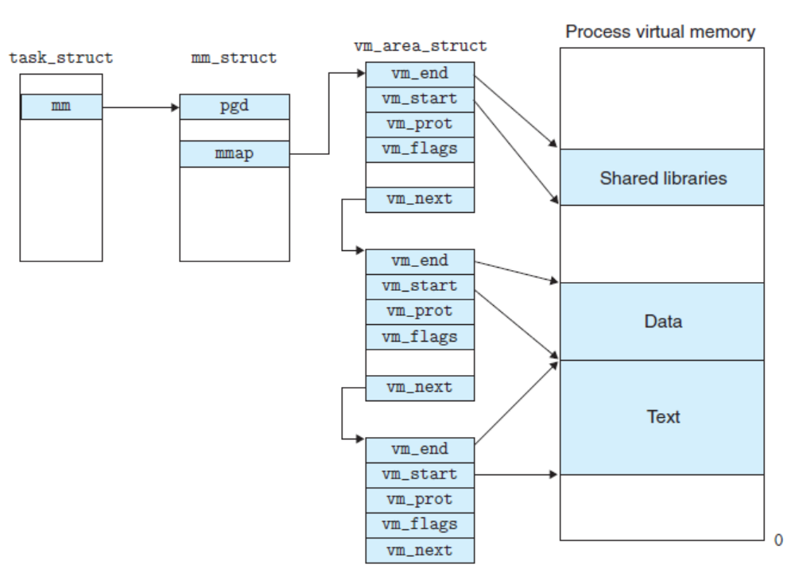

# mmap


# 为什么使用mmap

我们将sstable序列化到磁盘时需要设计文件读写操作。一般的文件read、write操作需要经过两次拷贝。一次从磁盘到内核的页缓存，一次从页缓存到用户虚拟内存空间。而使用mmap可以直接在用户内存空间与磁盘文件之间建立映射，从而减少一次内存拷贝。

下面我们详细介绍以下mmap的原理。

对于Linux内核使用vm_area_struct（虚拟内存_区域_结构体）来组织内存空间。



每一个vm_srea_struct代表一块不同类型的虚拟内存空间。如上图所示，vm_area_struct记录了一块内存的位置以及其他信息，同时使用链表的方式将每个进程的vm_area_struct链接在一起表示一个进程的虚拟内存空间。vm_area_struct中还包含一个vm_ops指针，其指向当前area可以使用的系统调用函数。

mmap映射的实现可以分为三个阶段：

- 用户调用mmap函数。在当前虚拟内存空间找到一块地址，分配一个vm_area_struct结构对这块地址初始化，并插入虚拟区域链表中
- 通过mmap给定的文件指针，找到文件inode并定位到文件磁盘物理地址。建立文件地址到虚拟地址区域的映射关系。注意此时并没有任何数据在mmap对应的内存中。
- 进程访问，引发缺页异常。进程先在交换空间寻找内存页，如果没有就从磁盘装载页到内存。

最后进程可以对这块内存区域进行读写操作，如果写入数据改变内容，系统会每隔一段时间将脏页写回磁盘。

# MmapFile

这里我们对Linux标准库中的mmap函数进行封装，从而作为sstable的底层文件接口使用。可以认为sstable文件实际上就对应了一个MmapFile。

## 数据结构

```go
// MmapFile表示一个mmapd文件，包括数据缓冲区和文件描述符
type MmapFile struct {
	Data []byte
	Fd   *os.File
}
```

## 文件加载

OpenMmapFile给出文件名、读写权限以及文件大小。加载并返回对应文件的MmapFile对象。等价于MmapFile构造函数。

```go
// 这个函数使用mmap创建给定文件到内存的映射，并返回MmapFile对象指针
func OpenMmapFileUsing(fd *os.File, sz int, writable bool) (*MmapFile, error) {
	filename := fd.Name()
	fi, err := fd.Stat()
	if err != nil {
		return nil, errors.Wrapf(err, "cannot stat file: %s", filename)
	}

	var rerr error
	//文件大小为0（说明是新文件），则将文件设置为sz大小
	fileSize := fi.Size()
	if sz > 0 && fileSize == 0 {
		// file为空，truncate到sz大小
		if err := fd.Truncate(int64(sz)); err != nil {
			return nil, errors.Wrapf(err, "error while truncation")
		}
		fileSize = int64(sz)
	}

	// mmap将filesize大小文件映射到内存
	buf, err := mmap.Mmap(fd, writable, fileSize)
	if err != nil {
		return nil, errors.Wrapf(err, "while mmapping %s with size: %d", fd.Name(), fileSize)
	}

	if fileSize == 0 {
		dir, _ := filepath.Split(filename)
		go SyncDir(dir) //将filename所在目录的目录文件刷新到磁盘
	}
	return &MmapFile{
		Data: buf,
		Fd:   fd,
	}, rerr
}

// OpenMmapFile打开现有文件或创建新文件。
// 如果创建了该文件，则会将该文件截断为maxSz。
// 在这两种情况下，它都会将文件mmap到maxSz大小并返回。
func OpenMmapFile(filename string, flag int, maxSz int) (*MmapFile, error) {

	fd, err := os.OpenFile(filename, flag, 0666)
	if err != nil {
		return nil, errors.Wrapf(err, "unable to open: %s", filename)
	}
	writable := true
	if flag == os.O_RDONLY {
		writable = false
	}
	// 如果 sst文件层被打开过，则使用其文件原来的大小
	if fileInfo, err := fd.Stat(); err == nil && fileInfo != nil && fileInfo.Size() > 0 {
		maxSz = int(fileInfo.Size())
	}
	return OpenMmapFileUsing(fd, maxSz, writable)
}

func SyncDir(dir string) error {
	df, err := os.Open(dir)
	if err != nil {
		return errors.Wrapf(err, "while opening %s", dir)
	}
	if err := df.Sync(); err != nil {
		return errors.Wrapf(err, "while syncing %s", dir)
	}
	if err := df.Close(); err != nil {
		return errors.Wrapf(err, "while closing %s", dir)
	}
	return nil
}
```


## 内存读写

```go
// 返回从偏移量off开始大小为sz的字节序列slice，如果没有足够的数据，返回空silce
func (m *MmapFile) Bytes(off, sz int) ([]byte, error) {
	if len(m.Data[off:]) < sz {
		return nil, io.EOF
	}
	return m.Data[off : off+sz], nil
}

// 返回给定偏移量的slice（给定偏移量的首4字节被解析为数据长度）
func (m *MmapFile) Slice(offset int) []byte {
	sz := binary.BigEndian.Uint32(m.Data[offset:]) //offset开始的4字节按大端序解析为Uint32，表示数据长度
	start := offset + 4
	next := start + int(sz)
	if next > len(m.Data) {
		return []byte{}
	}
	res := m.Data[start:next]
	return res
}
```


## 内存分配/扩容

AllocateSlice和AppendBuffer都是对MmapFile进行扩容的接口。其中AllocateSlice单纯的希望申请sz大小空间，如果不够则进行扩容。AppendBuffer则是将一定大小的buffer数据追加到现有MmapFile内存中。

```go
// 分配给定大小和给定偏移量的slice
func (m *MmapFile) AllocateSlice(sz, offset int) ([]byte, int, error) {
	start := offset + 4

	// 如果文件太小，将其大小翻倍，最多增长1GB
	if start+sz > len(m.Data) {
		const oneGB = 1 << 30
		growBy := len(m.Data)
		if growBy > oneGB {
			growBy = oneGB
		}
		if growBy < sz+4 {
			growBy = sz + 4
		}
		if err := m.Truncature(int64(len(m.Data) + growBy)); err != nil { //文件和缓冲区调整为对应大小
			return nil, 0, err
		}
	}

	binary.BigEndian.PutUint32(m.Data[offset:], uint32(sz))
	return m.Data[start : start+sz], start + sz, nil
}

// 向内存中追加一个buffer，如果空间不足则重新映射，扩大空间
func (m *MmapFile) AppendBuffer(offset uint32, buf []byte) error {
	size := len(m.Data)
	needSize := len(buf)
	end := int(offset) + needSize
	if end > size {
		growBy := size
		if growBy > oneGB {
			growBy = oneGB
		}
		if growBy < needSize {
			growBy = needSize
		}
		if err := m.Truncature(int64(end)); err != nil { //文件和缓冲区调整为对应大小
			return err
		}
	}
	dLen := copy(m.Data[offset:end], buf)
	if dLen != needSize {
		return errors.Errorf("dLen != needSize AppendBuffer failed")
	}
	return nil
}

// Truncature 兼容接口
func (m *MmapFile) Truncature(maxSz int64) error {
	if err := m.Sync(); err != nil { //mmap写回磁盘
		return fmt.Errorf("while sync file: %s, error: %v\n", m.Fd.Name(), err)
	}
	if err := m.Fd.Truncate(maxSz); err != nil { //文件截断（实际使用中是对文件进行扩充）
		return fmt.Errorf("while truncate file: %s, error: %v\n", m.Fd.Name(), err)
	}

	var err error
	m.Data, err = mmap.Mremap(m.Data, int(maxSz)) // 改变现有内存映射到maxsz大小
	return err
}
```

## 刷入磁盘、删除、关闭

注意MmapFile的Sync操作非常重要。因为在默认情况下由操作系统决定何时写回脏页到磁盘中，如果我们需要立即持久化数据，那么应该记得调用Sync主动刷写数据到磁盘中。比如说我们的wal文件，同样底层使用了mmap进行读写，wal文件本质上就是要保证数据插入的持久性，因此每次向wal文件写入数据都要立即写回磁盘。

我们的MmapFile对象的Truncate、AppendBuffer、AllocateSlice都会调用Sync刷写磁盘。

```go
// 将MmapFile写回磁盘
func (m *MmapFile) Sync() error {
	if m == nil {
		return nil
	}
	return mmap.Msync(m.Data)
}

// 删除MampFile
func (m *MmapFile) Delete() error {
	if m.Fd == nil {
		return nil
	}

	if err := mmap.Munmap(m.Data); err != nil { //删除映射
		return fmt.Errorf("while munmap file: %s, error: %v\n", m.Fd.Name(), err)
	}
	m.Data = nil
	if err := m.Fd.Truncate(0); err != nil { //文件截断为0（疑惑，都要删除文件了，为什么还要截断）
		return fmt.Errorf("while truncate file: %s, error: %v\n", m.Fd.Name(), err)
	}
	if err := m.Fd.Close(); err != nil { //关闭文件
		return fmt.Errorf("while close file: %s, error: %v\n", m.Fd.Name(), err)
	}
	return os.Remove(m.Fd.Name())
}

// 关闭MmapFile
func (m *MmapFile) Close() error {
	if m.Fd == nil {
		return nil
	}
	if err := m.Sync(); err != nil { //写回磁盘
		return fmt.Errorf("while sync file: %s, error: %v\n", m.Fd.Name(), err)
	}
	if err := mmap.Munmap(m.Data); err != nil { //删除映射
		return fmt.Errorf("while munmap file: %s, error: %v\n", m.Fd.Name(), err)
	}
	return m.Fd.Close() //关闭文件
}
```


# mmapReader


```go
type mmapReader struct {
	Data   []byte
	offset int //Data偏移量
}

// 从mmapReader中读取offset及之后数据到传入的buf字节序列中
func (mr *mmapReader) Read(buf []byte) (int, error) {
	if mr.offset > len(mr.Data) {
		return 0, io.EOF
	}
	n := copy(buf, mr.Data[mr.offset:])
	mr.offset += n
	if n < len(buf) {
		return n, io.EOF
	}
	return n, nil //没读完
}

// 创建mmapReader
func (m *MmapFile) NewReader(offset int) io.Reader {
	return &mmapReader{
		Data:   m.Data,
		offset: offset,
	}
}
```


