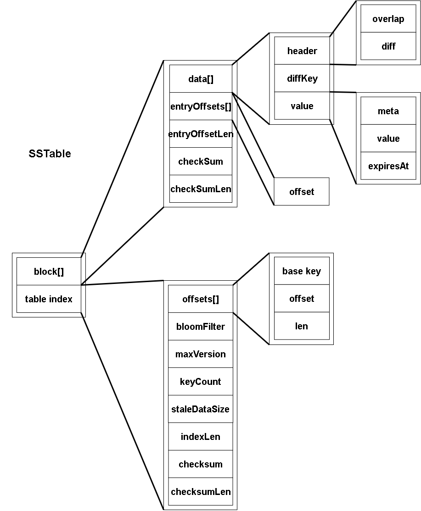
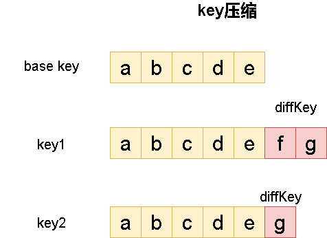

# sstable


# sstable文件构成

sstable是存储kv数据的文件，其总体构成如下如所示：



可以看到sstable整体上被分成两大部分。一部分是真正的数据一个block列表，一部分是记录block中索引信息的table index。

其中block中：data记录了entry，entryOffset和entryOffsetlen则记录了每条entry在block中的偏移量，即如何block中entry所需的信息。此外还有checkSum和checkSumLen对每个block进行数据校验。

在block的entry中存储了完整的value信息，但是并没有存储完整的key。这是因为sstable中entry总是按key有序排列的，因此相邻的key重复度很高，我们可以对key做压缩。而压缩的方法就是将block的第一个entry的key值作为base key，之后的key只存储与base key不同的部分。由于我们对block进行检索时确定key在哪个block也需要检查每个block的首个key（base key），因此base key被放在table index中。

table index中：offsets记录了sstable中所有block的索引信息，其中包括每个block的偏移量、长度以及base key。bloomfilter则是针对sstable中所有entry的布隆过滤器，这方便我们快速筛选一个entry是否存在于sstable中。还有其他有关block的元信息。


# sstable文件组织的一些考量

首先从总体上我们我们的sstable分为两个部分，一部分block list存储真正的数据，一部分是table index用于block的索引。之所以这么设计是因为sstable文件相当大，我们不可能从sstable中读取数据一次性将整个sstable都加载到内存，因此sstable数据总是以block为单位进行组织。另一方面需要一些索引信息来告诉我们应该将哪个block加载到内存中这就是table index存在的意义。注意我们将block的索引信息单独存储而不是与block绑定，这样对于每个sstable的table index信息可以常驻在内存中以方便查询。

**加速查询**

如果了解LSM-tree总体架构就会知道，sstable在磁盘中被组织为一定的层次结构。最上层L0层的sstable是由memtable直接刷写得到的，因此是无序的。而其他层则是全局有序的。因此如果我们想在所有sst文件中查询一条entry数据，需要搜索L0层所有可能的表，同时其他层如果存在的话需要至多搜索一个表。这样的遍历是相当耗时的，我们希望能够快速判断一个key到底是不是在一个sstable中。因此我们对每个sstable中数据构建一个bloomfilter来加速搜索过程。

**空间压缩**

对于sstable我们希望能够减少空间占用。因此对于每条entry中的key都使用了压缩。为什么不压缩value，那是因为value本身无序，相邻数据之间重合率不高，或者从信息论角度看他们之间互信息不大，因此很难被压缩。而key由于是有序排序，相邻key之间重合度大，容易压缩。

那么如何压缩key值呢？我们的实现方式非常简单。将每一个block中的第一个key作为base key。其他key则只记录与base key不同的地方：



事实上在levelDB中也用类似的方式来进行压缩，但是其压缩方式是保存当前key和上一个key的不同。这使得压缩率更高，但同时由于我们保存的是相邻key之间的不同，要想获得某个key，我们必须把前面所有key都解析出来。这使得我们无法进行随机访问，或者说在某个block中搜索key时无法进行二分查找。为此levelDB将block又划分为更小的单元，称为group。


# sstable如何序列化

这里我们直接使用protobuf序列化工具对sstable进行序列化。但要注意的是我们应该对每个block数据单独序列化，因为我们以block为单位加载到内存中。


# SSTable


## 功能

SSTable代表一个磁盘上的sstable文件。它包括了一个MmapFile对象表示所有数据。

除此之外SSTable还将一些重要的字段从MmapFile中提取出来以方便数据检索：如maxKey、minKey标识了当前sstable的键值分布范围、table index存储了用于检索block的偏移量，用于快速判断数据是否在当前sstable的布隆过滤器以及其它信息。

注意我们并不会将所有数据信息提取出来。即sstable中的block信息，因为从磁盘加载所有这些信息是很耗时的。我们在检索数据时根据bloom filter、table index这些信息判断数据在哪个block，然后加载对应block数据即可。

另外在我们实现的SSTable对象中并不会实现对sst文件的写入

## 数据结构

```go
// SSTable 文件的内存封装
type SSTable struct {
	lock           *sync.RWMutex
	f              *MmapFile
	maxKey         []byte         //最大key
	minKey         []byte         //最小key
	idxTables      *pb.TableIndex //index table
	hasBloomFilter bool           //是否有bloom filter
	idxLen         int            //index table长度
	idxStart       int            //index table起始位置
	fid            uint64         //ID
	createdAt      time.Time      //sst文件创建时间
}
```

其中pb.TableIndex的定义如下：

```
message TableIndex{
        repeated BlockOffset offsets = 1;
        bytes  bloomFilter = 2;
        uint64 maxVersion = 3;
        uint32 keyCount = 4;
        uint32 staleDataSize = 5;
}
```

pb.BlockOffset定义如下：

```
message BlockOffset{
        bytes key = 1;
        uint32 offset = 2;
        uint32 len = 3;
}
```

## 加载并初始化sstable

OpenSStable用于从文件配置opt中加载一个sstable文件并返回SSTable对象指针。

```go
// OpenSStable 打开一个sst文件
func OpenSStable(opt *Options) *SSTable {
	omf, err := OpenMmapFile(opt.FileName, os.O_CREATE|os.O_RDWR, opt.MaxSz)
	utils.Err(err)
	return &SSTable{f: omf, fid: opt.FID, lock: &sync.RWMutex{}}
}
```

Init用于从SSTable对应的MmapFile中提取相关信息，这些信息方便对其中kv数据进行检索。注意Init函数中maxKey的值设置是错误的，在table模块的openTable函数中会被置为正确的值。

```go
// Init 初始化
func (ss *SSTable) Init() error {
	var ko *pb.BlockOffset
	var err error
	//加载table index并获得第一个block的BlockOffset
	if ko, err = ss.initTable(); err != nil {
		return err
	}
	// 从文件中获取创建时间
	stat, _ := ss.f.Fd.Stat()
	statType := stat.Sys().(*syscall.Stat_t)
	ss.createdAt = time.Unix(statType.Ctim.Sec, statType.Ctim.Nsec)
	// 初始化最小key
	keyBytes := ko.GetKey()
	minKey := make([]byte, len(keyBytes))
	copy(minKey, keyBytes)
	ss.minKey = minKey
	ss.maxKey = minKey  //注意这里的maxKey是错误的，在table模块的openTable函数中被置为正确的值
	return nil
}

// 初始化sstable，从字节序列中加载sstable数据
func (ss *SSTable) initTable() (bo *pb.BlockOffset, err error) {
	readPos := len(ss.f.Data)

	// 从最后4字节读取校验和长度
	readPos -= 4
	buf := ss.readCheckError(readPos, 4)
	checksumLen := int(utils.BytesToU32(buf))
	if checksumLen < 0 {
		return nil, errors.New("checksum length less than zero. Data corrupted")
	}

	// 读取校验和
	readPos -= checksumLen
	expectedChk := ss.readCheckError(readPos, checksumLen)

	// 从footer读取index大小
	readPos -= 4
	buf = ss.readCheckError(readPos, 4)
	ss.idxLen = int(utils.BytesToU32(buf))

	// 读取table index
	readPos -= ss.idxLen
	ss.idxStart = readPos
	data := ss.readCheckError(readPos, ss.idxLen)
	if err := utils.VerifyChecksum(data, expectedChk); err != nil { //检验index块校验和
		return nil, errors.Wrapf(err, "failed to verify checksum for table: %s", ss.f.Fd.Name())
	}

	indexTable := &pb.TableIndex{}
	if err := proto.Unmarshal(data, indexTable); err != nil { //table index反序列化
		return nil, err
	}

	ss.idxTables = indexTable

	ss.hasBloomFilter = len(indexTable.BloomFilter) > 0

	// 有block offset就返回首个block offset，否则返回nil
	if len(indexTable.GetOffsets()) > 0 {
		return indexTable.GetOffsets()[0], nil
	}
	
	return nil, errors.New("read index fail, offset is nil")
}

// 读取sstable给定偏移量off处开始sz字节的字节序列
func (ss *SSTable) read(off, sz int) ([]byte, error) {
	//如果内存缓冲区有数据，直接读取返回
	if len(ss.f.Data) > 0 {
		if len(ss.f.Data[off:]) < sz {
			return nil, io.EOF
		}
		return ss.f.Data[off : off+sz], nil
	}
	//内存缓冲区没数据，直接读取文件
	res := make([]byte, sz)
	_, err := ss.f.Fd.ReadAt(res, int64(off))
	return res, err
}

// 读取sstable给定偏移量off处开始sz字节的字节序列，并检查错误
func (ss *SSTable) readCheckError(off, sz int) []byte {
	buf, err := ss.read(off, sz)
	utils.Panic(err)
	return buf
}
```

## Get/Set SSTable信息

下面是一组Get函数用于获取SSTable相关信息

```go
// 返回index table
func (ss *SSTable) Indexs() *pb.TableIndex {
	return ss.idxTables
}

// 返回maxKey
func (ss *SSTable) MaxKey() []byte {
	return ss.maxKey
}

// 返回minKey
func (ss *SSTable) MinKey() []byte {
	return ss.minKey
}

// 返回fid
func (ss *SSTable) FID() uint64 {
	return ss.fid
}

// 返回hasBloomFilter
func (ss *SSTable) HasBloomFilter() bool {
	return ss.hasBloomFilter
}

// 返回底层文件的尺寸
func (ss *SSTable) Size() int64 {
	fileStats, err := ss.f.Fd.Stat()
	utils.Panic(err)
	return fileStats.Size()
}

// 返回创建时间createdAt
func (ss *SSTable) GetCreatedAt() *time.Time {
	return &ss.createdAt
}
```


下面是Set函数用于设置SSTable信息。前面已经提到SSTable对象的maxKey是错误的，因此这里专门设置SetMaxKey函数对maxKey设置。

```go
// SetMaxKey max 需要使用table的迭代器，来获取最后一个block的最后一个key
func (ss *SSTable) SetMaxKey(maxKey []byte) {
	ss.maxKey = maxKey
}

// 设置创建时间
func (ss *SSTable) SetCreatedAt(t *time.Time) {
	ss.createdAt = *t
}
```

## 底层MmapFile包装函数

下面函数封装了SSTable中MmapFile的一些操作

```go
// 返回从偏移量off开始sz字节序列切片
func (ss *SSTable) Bytes(off, sz int) ([]byte, error) {
	return ss.f.Bytes(off, sz)
}

// 删除MmapFile
func (ss *SSTable) Detele() error {
	return ss.f.Delete()
}

// 关闭sstable mmap文件
func (ss *SSTable) Close() error {
	return ss.f.Close()
}

// 截断MmapFile
func (ss *SSTable) Truncature(size int64) error {
	return ss.f.Truncature(size)
}
```


